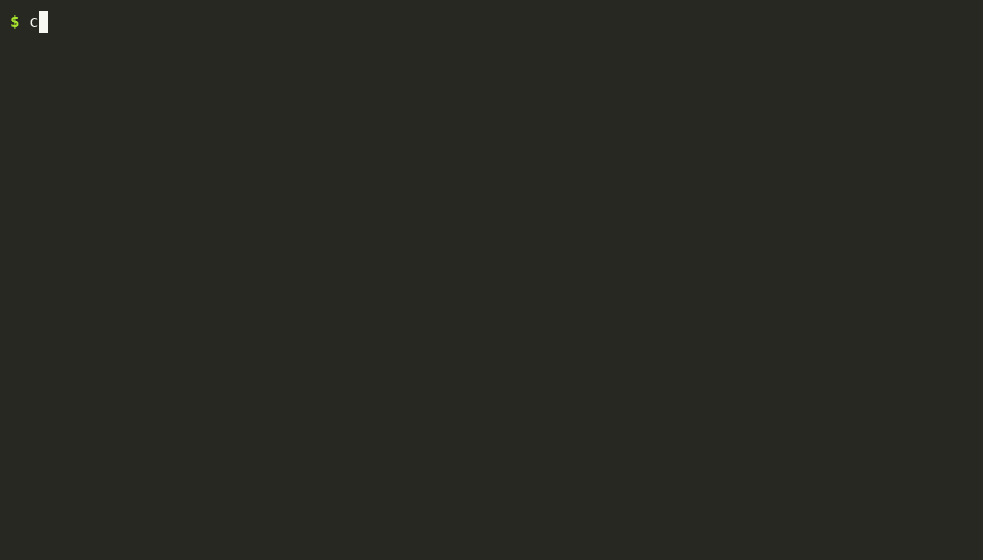
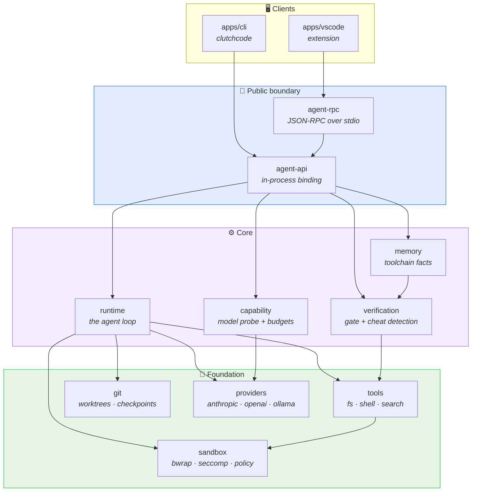
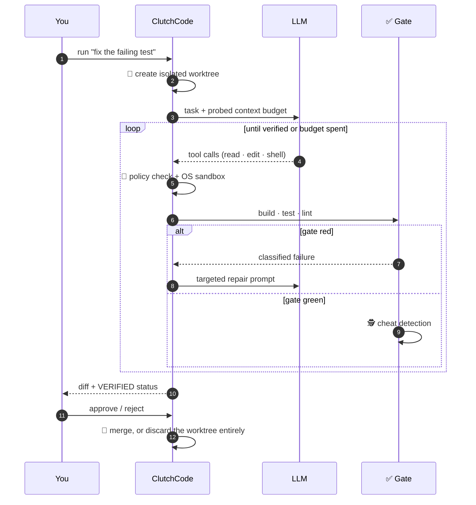
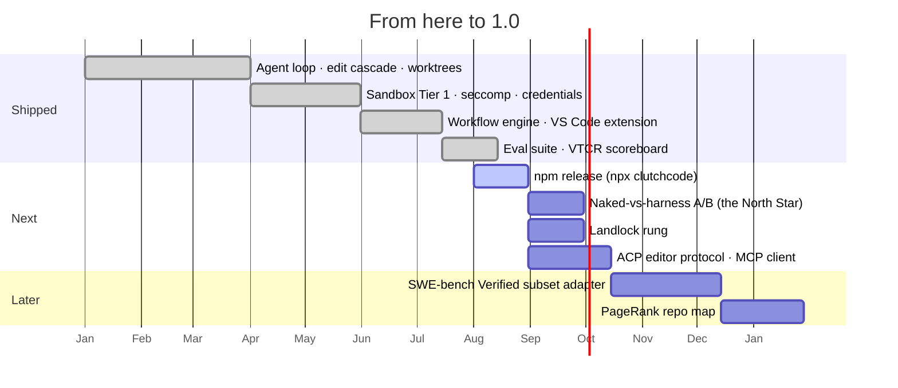

<div align="center">


<!-- Custom logo: replace the banner above with
      once one exists. -->

*A model-agnostic, local-first coding-agent runtime. It never phones home, and "done" means your build and tests actually passed — not that the model said so.*

<br/>

[](./LICENSE)
[](https://nodejs.org)
[](https://www.typescriptlang.org/)
[](#-what-were-actually-sure-of)
[](https://github.com/Derric01/ClutchCode/actions/workflows/ci.yml)

[](https://github.com/Derric01/ClutchCode/stargazers)
[](https://github.com/Derric01/ClutchCode/network/members)
[](https://github.com/Derric01/ClutchCode/issues)
[](./CONTRIBUTING.md)

**[Quick Start](#-quick-start) · [How It Works](#-how-it-works) · [Architecture](#%EF%B8%8F-architecture) · [Security](./SECURITY.md) · [Roadmap](#%EF%B8%8F-roadmap)**

</div>

---

<div align="center">



*Real terminal output, recorded from this build — `doctor`'s sandbox/keychain detection, then a `run` against `--provider fake` (no API key, no model, exercises the exact same lifecycle a real provider would). Recorded with [asciinema](https://asciinema.org) + [agg](https://github.com/asciinema/agg); regenerate with `bash docs/assets/record-demo.sh` after any user-facing CLI change.*

```console
$ clutchcode run "fix the failing test" --provider ollama --model qwen2.5-coder:14b
$ clutchcode diff    <runId>      # review what it actually changed
$ clutchcode approve <runId>      # only now does it touch your branch
```

</div>

---

## ✨ Why this exists

Every coding agent will tell you it finished. Almost none of them can prove it.

ClutchCode is built around one rule: **the model's opinion doesn't count.** A run isn't complete until a deterministic gate — your real build, your real tests, your real linter — actually passes. And because a model under pressure will happily delete the assertion that's failing, there's a **cheat-detection layer** whose only job is catching that.

> A model once "fixed" a failing test by deleting its assertion. Verification went green. Cheat detection blocked the run anyway. That scenario is a permanent test in this repo, not an anecdote.

---

## 🎯 What it does

Point it at a task and a model. It works in an **isolated git worktree**, edits code, runs your toolchain, repairs what it broke, and stops. Nothing reaches your branch until you approve a diff.

<table>
<tr>
<td width="50%" valign="top">

**🔒 Runs sandboxed by default**
Real OS confinement — bubblewrap namespaces plus a seccomp-BPF filter, verified against the actual kernel. Network is default-deny at the OS level, not just in policy.

</td>
<td width="50%" valign="top">

**🏠 Local-first, provably**
No account, no telemetry, no cloud. Enforced by a release-gate test that completes a task **offline with egress blocked** against a local model.

</td>
</tr>
<tr>
<td width="50%" valign="top">

**🧩 Model-agnostic**
A capability probe adapts edit format, context budget and output reservation to whatever you point it at — frontier API or a 14B model on your own GPU.

</td>
<td width="50%" valign="top">

**↩️ Nothing lands without review**
Every run is a worktree on its own branch, with per-step checkpoints you can roll back to. `approve` or `reject`, your call.

</td>
</tr>
</table>

---

## 🏗️ Architecture

Ten packages, strict boundaries. `apps/*` depend **only** on `agent-api` — never on runtime internals.



<details>
<summary><b>Why the boundary matters</b></summary>

<br/>

The CLI, the VS Code extension, and any future editor client all share **100% of the runtime code**; only presentation differs. That's why `agent-api` exists as a hard boundary rather than a convention — and why the same runtime can be driven in-process or over stdio JSON-RPC without a second implementation.

</details>

---

## 🧠 How it works



The interesting step is the one most agents skip: **after the gate goes green, it gets audited.** Deleted assertions, `.skip` markers, hardcoded return values, snapshot edits with no source rationale — all block completion even in `--yes` mode.

---

## ⚡ Features

| | Feature | Detail |
|:--:|---|---|
| 🔬 | **Deterministic completion gate** | Real build + test + lint. No self-reported success. |
| 🕵️ | **Cheat detection** | Catches deleted assertions, skip markers, hardcoded outputs, unjustified snapshot edits. |
| 📦 | **Git worktree isolation** | Per-run branch, per-step checkpoints, `rollback` to any of them. |
| 🛡️ | **Tier-1 OS sandbox** | bubblewrap + seccomp-BPF (x86_64 Linux, kernel-verified). Seatbelt profile for macOS. |
| 🔑 | **3-tier credential storage** | OS keychain → encrypted file store → env. Keys read from stdin, never argv. |
| 🧽 | **Secret redaction** | Every boundary scrubbed, proven by a canary test that injects a fake secret. |
| 🎛️ | **Workflow engine** | `default` · `quickfix` · `review-only`, plus JSON-Schema-validated custom workflows. |
| ⏸️ | **Resumable runs** | Hit a budget? `resume --extend-steps N` continues from the persisted transcript. |
| 🧪 | **Replay harness** | Recorded transcripts re-run the whole loop with zero API calls. |

---

## 🛠️ Tech Stack

<div align="center">


</div>

Deliberately dependency-light. The seccomp BPF filter is hand-assembled in TypeScript rather than pulling a native module — the entire runtime's external dependencies are `commander`, `ajv`, and `smol-toml`.

---

## 🚀 Quick Start

**Requirements** — Node ≥ 20, pnpm, git. On Linux, `bubblewrap` for the OS sandbox (without it you get Tier 0 — policy engine only — and `doctor` will say so).

```bash
git clone https://github.com/Derric01/ClutchCode.git
cd ClutchCode && pnpm install && pnpm build
```

<details open>
<summary><b>1 · Check what your machine supports</b></summary>

```bash
clutchcode doctor      # sandbox backend, seccomp, keychain, toolchain
```
</details>

<details>
<summary><b>2 · Run a task</b></summary>

Local model via Ollama — no key needed:

```bash
clutchcode run "fix the failing test in src/parser.ts" \
  --provider ollama --model qwen2.5-coder:14b
```

Hosted provider — key is read from stdin, never argv or shell history:

```bash
clutchcode providers set-key anthropic     # paste, then Ctrl-D
clutchcode run "add pagination to /users" --provider anthropic --model claude-sonnet-5
```

Bound it: `--max-steps`, `--max-tokens`, `--cost-ceiling-usd`.
</details>

<details>
<summary><b>3 · Review before anything touches your branch</b></summary>

```bash
clutchcode status              # all runs and their state
clutchcode diff    <runId>     # what changed
clutchcode approve <runId>     # merge it back
clutchcode reject  <runId>     # discard the worktree entirely
```

`--yes` auto-approves **only** when the gate is green *and* cheat detection flags nothing.
</details>

<details>
<summary><b>4 · Try it with no model at all</b></summary>

```bash
clutchcode run "…" --provider fake
```

Replays a scripted transcript through the whole loop. It's how the test suite works.
</details>

---

## 📊 What we're actually sure of

No invented benchmarks here. The eval scoreboard now exists — **but no VTCR number for any real model is published, because none has been measured** (this project's CI has neither an API key nor a local GPU). What the scoreboard gives you is the machinery to measure your own, and a methodology you can argue with: [`docs/EVAL_METHODOLOGY.md`](./docs/EVAL_METHODOLOGY.md).

| Claim | How it's proven |
|---|---|
| **774 tests, 83 files** | `pnpm test`. Real git repos, real shells, real filesystems — `FakeProvider` stubs *only* the model. |
| **The suite runs on CI, not just locally** | GitHub Actions, Node 20 + 22 on every PR: `758 passed | 16 skipped (774)`, plus `tsc -b` and `eslint .`. The 16 skips are the bwrap confinement/seccomp suites — a hosted runner cannot create those namespaces, so they skip there and run in full locally (774, 0 skipped). **CI green therefore does not prove the sandbox confines**; only a bwrap-capable host does. |
| **Sandbox actually confines** | A test writes outside the workspace, then asserts a sandboxed `cat` of it fails. Network fetch inside the sandbox asserted unreachable. These run for real wherever bwrap can genuinely create namespaces (this project's dev container can); where it can't — a hosted CI runner, an unprivileged container — they skip and ClutchCode falls back to Tier 0 **and says so**, rather than claiming a confinement it isn't getting. |
| **Seccomp actually blocks** | Each denied syscall invoked by number inside real bwrap → `EPERM`, with an unfiltered control run proving the syscall otherwise succeeds. |
| **Secrets don't leak** | A canary secret injected into a full recorded run, asserted absent from every transcript, event log and artifact. |
| **Cheat detection works** | A recorded run where the model deletes an assertion — verification goes green, completion is blocked anyway. |
| **The scoreboard can't be fooled by a green gate** | Every eval task carries a **held-out** check, copied in only after the run finishes. A scripted run that changes nothing on an already-passing repo reaches `DONE` with a green gate — and is scored a *false completion*, not a success. |
| **The eval tasks are real tasks** | Every task is validated on each test run against real repos: its held-out check must fail on the pristine repo and pass on the reference solution. It caught a bad expectation in one of its own oracles the first time it ran. |
| **Local-first is real** | A task completed offline with egress blocked at the OS level, against a local model. |

<details>
<summary><b>🔍 Honest limitations — read this before trusting it</b></summary>

<br/>

- **Linux is the verified platform.** The macOS Seatbelt profile is written against the documented SBPL grammar but **has never run on real macOS**. Windows Tier 1 is deliberately doc-only; WSL2 is the recommended path.
- **Landlock is not implemented.** Seccomp is. The blocker is documented in `HANDOFF.md`.
- **No benchmark numbers are published for any model.** The eval suite, the VTCR/§16.2 metrics and the held-out grading all work and are tested — but the only scored runs so far are deterministic scripted ones. The naked-vs-harness A/B that would substantiate "makes small local models usable", and the SWE-bench-Verified subset, are both explicitly not built; see [`docs/EVAL_METHODOLOGY.md`](./docs/EVAL_METHODOLOGY.md) §7.
- **Pre-1.0**, not yet published to npm.
- **Security reviews have been thorough but single-reviewer.** See [`SECURITY.md`](./SECURITY.md) for the threat model and how to report an issue.

Anything this project can't verify is flagged in a header comment and here — silence implying completeness is treated as a defect.

</details>

---

## 🗺️ Roadmap



Live priority order lives in **[`HANDOFF.md`](./HANDOFF.md)** — exactly one row is tagged `DO FIRST` at any time.

---

## 🤝 Contributing

PRs welcome. A few things that are load-bearing here:

1. **`pnpm build && pnpm test && pnpm lint` must be clean** before every commit.
2. **Reproduce before fixing.** A finding is a hypothesis until you've made the bad thing actually happen.
3. **Prove your test discriminates** — stash the fix, watch the test fail, restore it, watch it pass.
4. **Never skip or disable a test to get green.** That falsifies the gate this project exists to enforce.
5. **Flag what you couldn't verify.** Honesty beats completeness.

Full guide in [`CONTRIBUTING.md`](./CONTRIBUTING.md) (DCO sign-off required). Design rationale is in [`PROJECT_SPEC.md`](./PROJECT_SPEC.md); engineering history in [`docs/PROJECT_LOG.md`](./docs/PROJECT_LOG.md).

---

## 📄 License

[Apache-2.0](./LICENSE) © ClutchCode contributors.

Reference projects (Aider, Codex, OpenHands, Cline, and others) are **study-only** — this implementation is clean-room. See [`LICENSE_AND_REUSE_ANALYSIS.md`](./LICENSE_AND_REUSE_ANALYSIS.md).

<div align="center">
<br/>

**If the idea of an agent that has to prove its work sounds right to you — ⭐ star it, or [open an issue](https://github.com/Derric01/ClutchCode/issues).**

</div>
